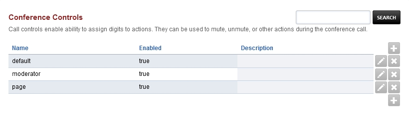
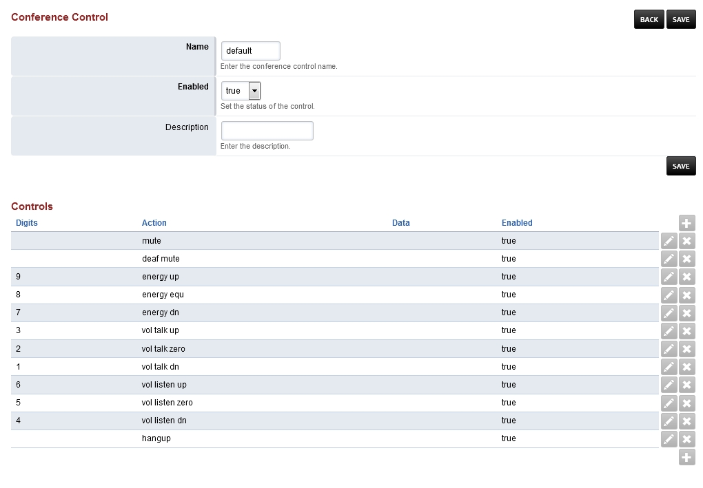

####################
Conference Controls
####################

Call controls enable ability to assign digits to actions. They can be used to mute, unmute, or other actions during the conference call. 

* Click the edit icon on the right to adjust the control
* Click the plus to create a new control set

Default Conference Control
^^^^^^^^^^^^^^^^^^^^^^^^^^^^^^

