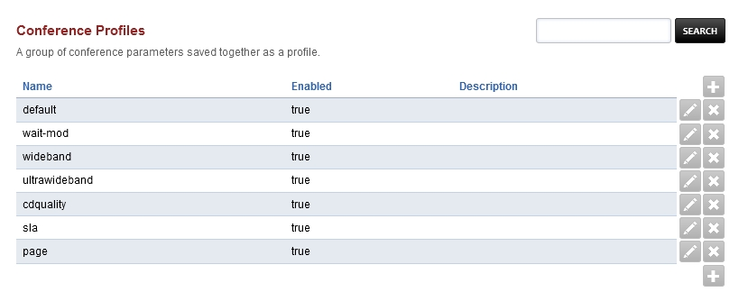
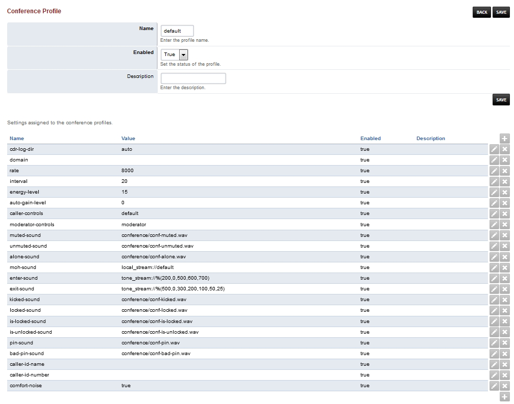

####################
Conference Profiles
####################

A group of conference parameters saved together as a profile.

* Click the edit icon on the right to adjust the profile
* Click the plus to create a new profile

Default Profile
^^^^^^^^^^^^^^^^

* cdr-log-dir: Set as auto.  Could be set manually and is enabled. 
* domain: enabled.
* rate: The rate in kHz. 8000kHz and is enabled. 
* interval: 20 is the default.
* energy-level: 15 is the default.
* auto-gain-level: 0 is the default.
* caller-controls: default is the default.
* moderator-controls: moderator is the default.
* muted-sound: conference/conf-muted.wav is the default.
* unmuted-sound: conference/conf-unmuted.wav is the default.
* alone-sound: conference/conf-alone.wav is the default.
* moh-sound: local_stream://default is the default.
* enter-sound: tone_stream://%(200,0,500,600,700) is the default.
* exit-sound: tone_stream://%(500,0,300,200,100,50,25) is the default.
* kicked-sound: conference/conf-kicked.wav is the default.
* locked-sound: conference/conf-locked.wav is the default.
* is-locked-sound: conference/conf-is-locked.wav is the default.
* is-unlocked-sound: conference/conf-is-unlocked.wav is the default.
* pin-sound: conference/conf-pin.wav is the default.
* bad-pin-sound: conference/conf-bad-pin.wav is the default.
* caller-id-name:
* caller-id-number:
* comfort-noise: true is the default.

