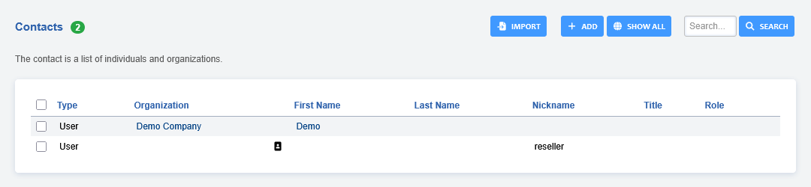
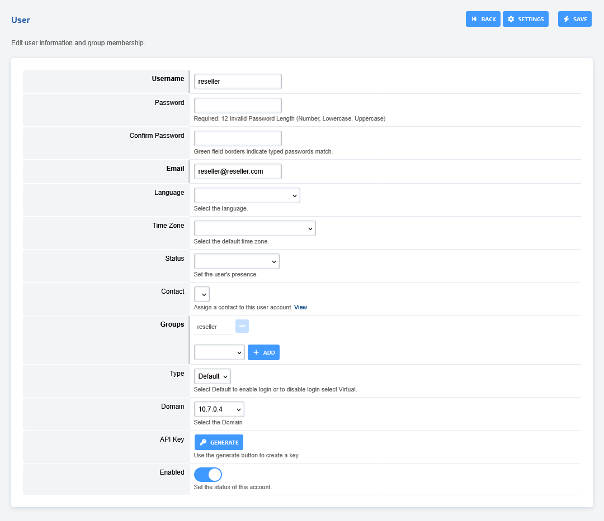
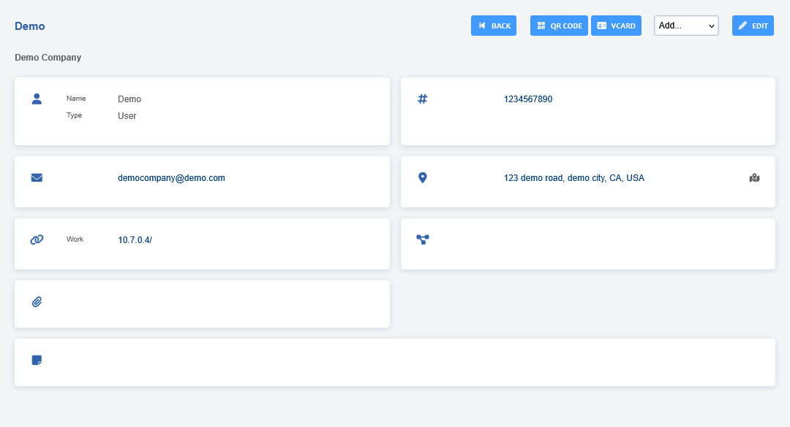
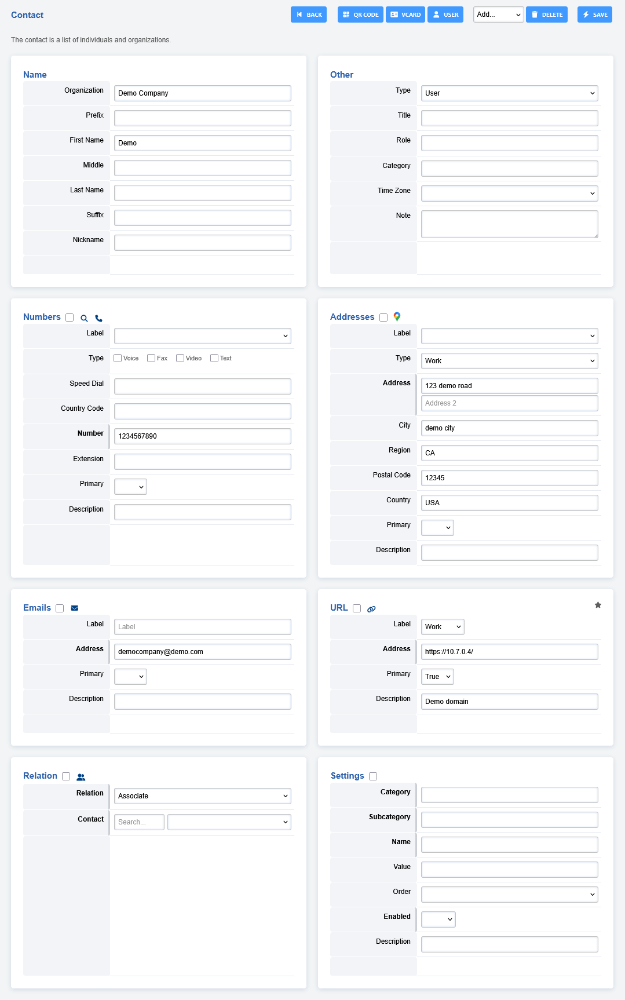

# Contacts

Contacts is a list of individuals and organizations.

-   Click **ADD** to create a new contact
-   Click **EDIT** to edit an existing contact
-   Fill out the fields with pertinent information and click save.
-   **Users-** Select the users that are allowed to view the contact
-   **Groups-** Select the group that are allowed access to the contact.

-   Click **EDIT** to add additional information that wasn't
    available when you first created the contact.

-   You can download a file copy of a contact by clicking **VCARD**
-   To generate a QR code click the **QR CODE** button

