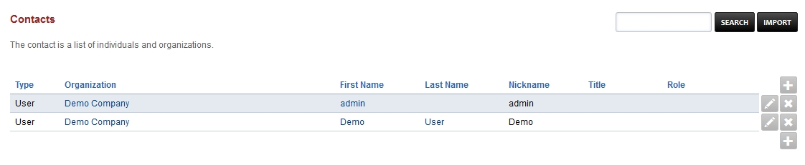
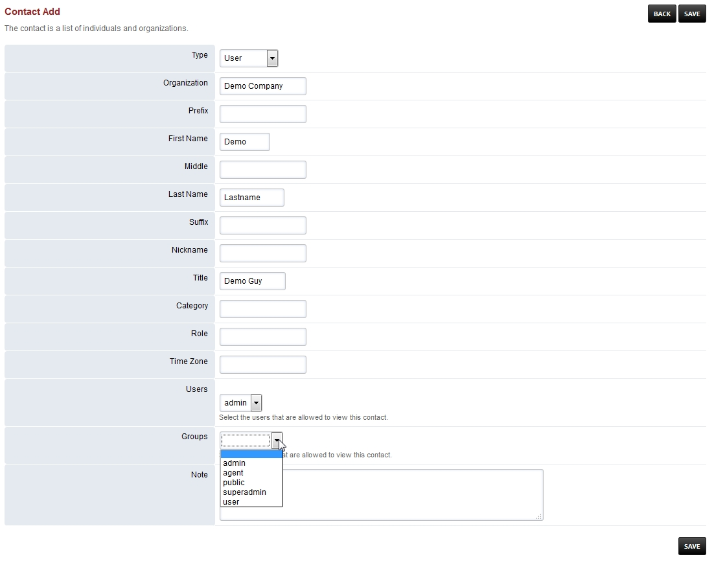
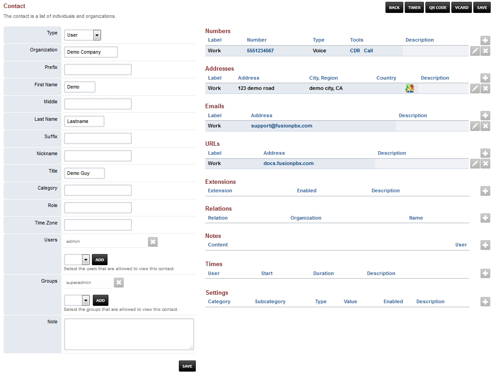
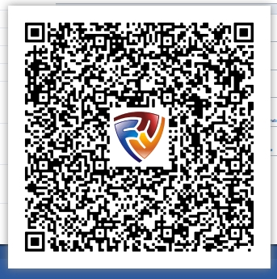

###########
Contacts
###########

Contacts is a list of individuals and organizations.

*  To create a contact click the **plus** and to edit a contact click the **pencil** icon on the right.
*  Fill out the fields with pertinent information and click save.
*  **Users-** Select the users that are allowed to view the contact
*  **Groups-** Select the group that are allowed access to the contact.

*  Go back into the contact to fill out more information that wasn't available when you first created the contact.

*  To generate a QR code click the **QR CODE** button at the top right

