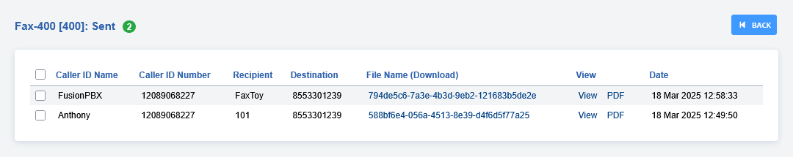

# Fax Server

To receive a FAX setup a fax extension and then direct the incoming to
it. [Click here for the Youtube video](https://youtu.be/AJHcle2U3n4)

 <div style="text-align: center; margin-bottom: 2em;">
 <iframe width="100%" height="350" src="https://www.youtube.com/embed/AJHcle2U3n4?rel=0" frameborder="0" ; encrypted-media" allowfullscreen></iframe>
 </div>

 <br>
 
Be sure to install the [FAX Queue](https://docs.fusionpbx.com/en/latest/status/fax_queue.html) service. The install commands are located in the FAX Queue document.    
This is essential for your FAX Server to work.


-   **New**: Create a new fax to send.
-   **Inbox**: Faxes received.
-   **Sent**: Faxes sent.
-   **Log**: Sucessful and failed attempts for both inbound and outbound.
-   **Queue**: Shows the faxes in queue.

## Fax Server Settings

There are more settings for fax under **Advanced** \> **Default Settings** then under category, select **Fax**.

To create a fax server goto **Applications** \> **Fax Server**. Click the "**ADD**" button on the right.

> **Note:** Make sure you leave the **Destination Number** blank or faxing wont work. All fields in **bold** are required.   
> It is also good practice accross FusionPBX to stay organized, so define the name and chosen extension thoughtfully.

-   **Account Code**: This item will autofill. 
-   **Destination Number**: This is used in the Fax Server Dial Plan and is set
    based on the fax server internal extension number.
-   **Extension**: Creates an extension for this Fax Server.
-   **Prefix**: Can be defined when sending a fax.
-   **Email**: This will be for inbound faxes, these will be on the server and sent to the
    defined emails.
-   **Fax File**: Option to attach files for faxing.
-   **Confirmation Email**: This sends notifications to your listed emails you when a fax has **Completed** or **Failed**. 
-   **Caller ID Name/Number**: Pretty self explanatory, this will display the defined ID name and number when faxing.
-   **Forward Number**: Forward the fax to a an extension or external number.
-   **Toll Allow**: Enter your toll allow value here.  


## New

To send a fax, the items in **bold** are required. To send a proper fax
it is best to fill out all fields and attach any documents. Keep in mind
that the upload max MB is limited by Nginx and PHP config files.


## Inbox

Click **PDF** to view the fax or right click on **PDF** and left click
on **Save Link As**. If you defined and email address in the **email**
field you will receive the fax also to that email address.


## Sent

Click **PDF** to view the fax or right click on **PDF** and left click
on **Save Link As**.



## Fax ATA

To connect to a fax machine with an ATA you will most likely need to
adjust settings in the ATA web interface and in FusionPBX.

Create an extension for the FAX machine. You can *optionally* set
**bypass media to true** under advanced in the extension settings.

## [FAX Default Settings](/en/latest/advanced/default_settings.html#id12)

**Menu** \> **Advanced** \> **Default Settings** then select category "**Fax**"

-   Variables are used as defaults for the dialplan for sending and
    receiving faxes


-   *fax_enable_t38_request=false* (Can be true or false)
-   *ignore_early_media=true* (Can be true or false)
-   Some carriers it's better for fax_enable_t38_request=true and for some its better for it to be false.
-   It's best not to make an assumption and to do testing with different settings to get the best results for your particular carrier.
-   The variable *fax_enable_t38_request=false* will send a T38 reinvite when a fax tone is detected. In some cases the re-invite always fails for some carriers which is why it is default to false.

### Troubleshooting Tips

Faxing will fail at times. Fax Server should automatically try different
methods for sending. There are different combinations like;

-   With T-38 on/off
-   ECC on/off
-   Sending a wav file
-   Send a fax to HP faxback.  This will test sending and receiving 1-888-473-2963
-   Test sending with Faxtoy.net This will display what is faxed on their website. 1-855-330-1239 or 1-213-294-2943
-   Turn on verbose log in FreeSWITCH fax.conf.xml
    *   From your FusionPBX installation go to ADVANCED > XML Editor and a new window will open.
    *   Choose autoload_configs folder from the list, then choose fax.conf.xml.
    *   In fax.conf.xml there is an option that by default sets a variable called verbose = false. If you change this to true you get more logging details as the fax is actually received, such as the quality of the connection etc.
    *   You can see these details when you run the freeswitch command line ie. **fs_cli** 

### Command Line Fax Statistics

Grep from ssh or console access your freeswitch.log files for FAX_RETRY_STATS to start keeping track of success/failure.
Examples

Here's how you can get some totals.

**Total:**
```
    cat freeswitch.log |grep FAX_RETRY_STATS |wc -l
```

**Success:**
```
    cat freeswitch.log |grep FAX_RETRY_STATS |grep SUCCESS |wc -l
```

**Failures:**
```
    cat freeswitch.log |grep FAX_RETRY_STATS |grep FAIL |wc -l
```
