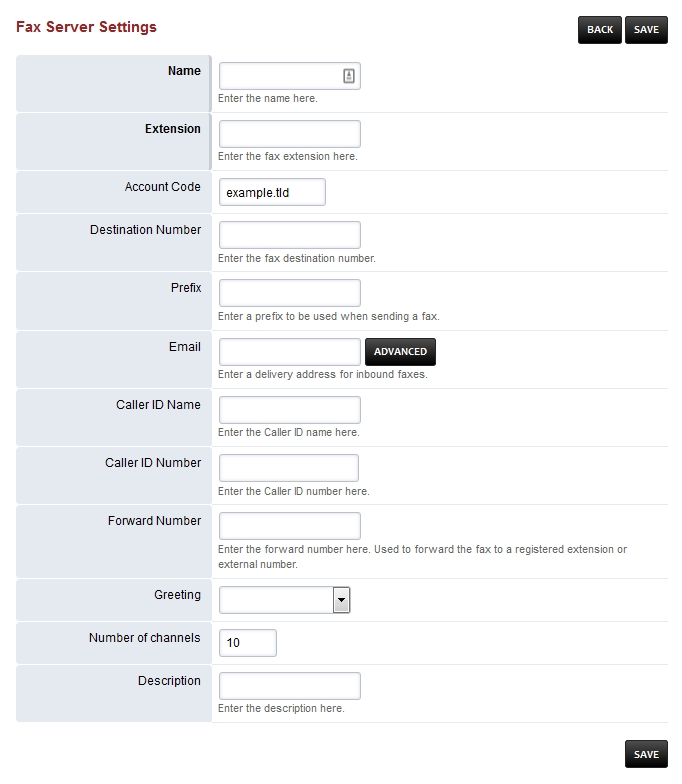

************
Fax Server
************

To receive a FAX setup a fax extension and then direct the incoming to it. `Click here for the Youtube video <https://youtu.be/AJHcle2U3n4>`_

.. image:: ../_static/images/fusionpbx_fax.jpg
        :scale: 85%

* New: Create a new fax to send.
* Inbox: Faxes received.
* Sent: Faxes sent.
* Log: Sucessful and failed attempts for both incoming and outgoing.
* Active: Shows the faxes in queue.

Fax Server Settings
====================

There are more settings for fax under Advanced > Default Settings then fax category.

To create a fax server goto App > Fax Server.  Click the + on the right. **Leave the Destination Number blank** or faxing wont work.  Destination Number is used in the Fax Server Dial Plan and is set based on the fax server internal extension number.  Define the fields, the ones in **bold** are required.  It is a good idea to organize so define the name thoughtfully.  The extension you must use one that is not allready created.  Account Code should autofill.  Again, **leave the Destination Number blank**.  A prefix can be defined when sending a fax.  Email is for inbound faxes and will be on the server and sent to the defines email. Define the Caller ID Name and Number.  Leave the Forward Number and Greeting blank for normal settings.  Number of channels define with a numerical value.  Keep organized by adding a Description.

New
====

To send a fax the items in **bold** are required.  To send a proper fax it is best to fill out all fields and attach any documents.  Keep in mind that the upload max MB is limited by Nginx and PHP config files.

.. image:: ../_static/images/fusionpbx_fax1.jpg
        :scale: 85%

Inbox
======

Click **PDF** to view the fax or right click on **PDF** and left click on **Save Link As**. If you defined and email address in the **email** field you will receive the fax also to that email address.

.. image:: ../_static/images/fusionpbx_fax4.jpg
        :scale: 85%

Sent
=====

Click **PDF** to view the fax or right click on **PDF** and left click on **Save Link As**.

.. image:: ../_static/images/fusionpbx_fax3.jpg
        :scale: 85%

Fax ATA
=========

To connect to a fax machine with an ATA you will most likely need to adjust settings in the ATA web interface and in FusionPBX.

Create an extension for the FAX machine. You can *optionally* set **bypass media to true** under advanced in the extension settings. 

FAX Default Settings
=====================

* Goto Menu -> Advanced -> Default Settings then category Fax

Troubleshooting Tips
~~~~~~~~~~~~~~~~~~~~~~

Faxing will fail at times. Fax Server should automatically try different methods for sending. There are different combinations like;

* With T-38 on/off
* ECC on/off
* Sending a wav file
* Send a fax to HP faxback.  This will test sending and receiving 1-888-473-2963
* Test sending with Faxtoy.net This will display what is faxed on their website. 1-855-330-1239 or 1-213-294-2943
