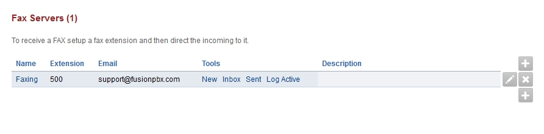
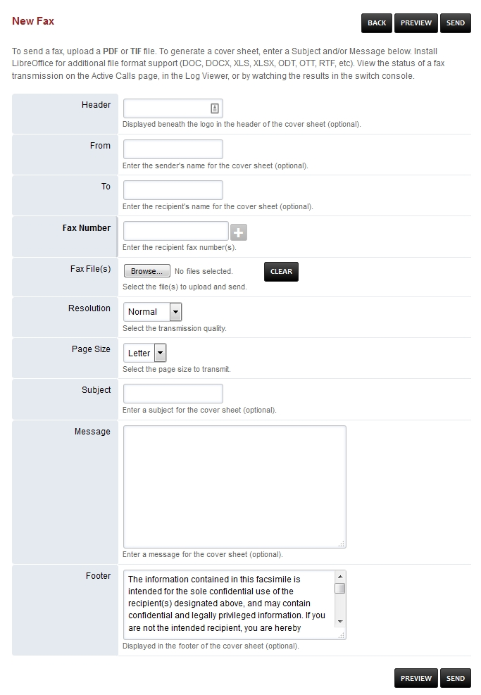
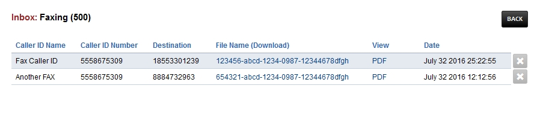
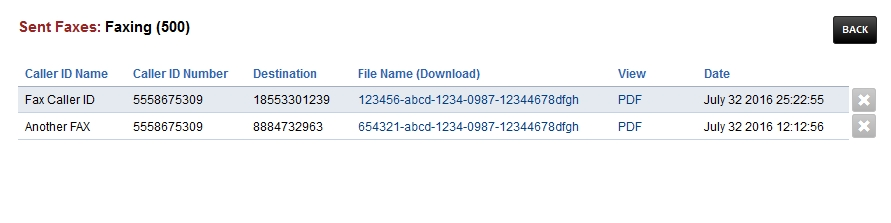

************
Fax Server
************

To receive a FAX setup a fax extension and then direct the incoming to it. 

* New: Create a new fax to send.
* Inbox: Faxes received.
* Sent: Faxes sent.
* Log: Sucessful and failed attempts for both incoming and outgoing.
* Active: Shows the faxes in queue.

New
====

To send a fax the items in **bold** are required.  To send a proper fax it is best to fill out all fields and attach any documents.  Keep in mind that the upload max MB is limited by Nginx and PHP config files.

Inbox
======

Click **PDF** to view the fax or right click on **PDF** and left click on **Save Link As**. If you defined and email address in the **email** field you will receive the fax also to that email address.

Sent
=====

Click **PDF** to view the fax or right click on **PDF** and left click on **Save Link As**.

Trouble shooting tips
~~~~~~~~~~~~~~~~~~~~~~

Faxing will fail at times. Fax Server should automatically try different methods for sending. There are different combinations like;

* With T-38 on/off
* ECC on/off
* Sending a wav file
