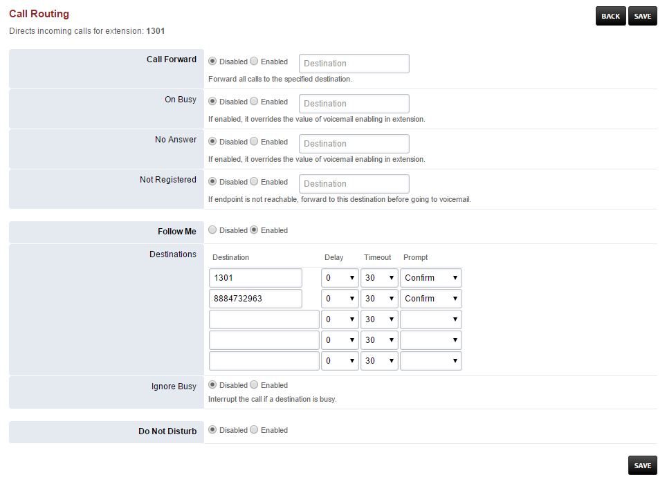

#############
Follow Me
#############

Define alternate inbound call handling for the following extensions.

*  **Call Forward-** (Disabled or Enabled) Input the destination number
*  **On Busy-** (Disabled or Enabled) If enabled, it overrides the value of voicemail enabling in extension
*  **No Answer-** (Disabled or Enabled) If enabled, it overrides the value of voicemail enabling in extension
*  **Not Registered-** (Disabled or Enabled) If endpoint is not reachable, forward to this destination before going to voicemail

*  **Follow Me-** (Disabled or Enabled)
*  **Destinations-** Can set Delay, Timeout and Prompt to accept the call.
*  **Ignore Busy-** (Disabled or Enabled) 
*  **Do Not Disturbe-** (Disabled or Enabled)

This example has both the extension 1301 itself and and external number to call.  If you don't put the extension itself the extension wont ring when in Follow Me.  This is due to the flexible nature of FusionPBX where if you didn't want that extension to ring like if you were out of the office on a business trip.

`Follow Me Default Settings`_
---------------------------------------

Click the link above for Follow Me default settings.

.. _Follow Me Default Settings: /en/latest/advanced/default_settings.html#id13

