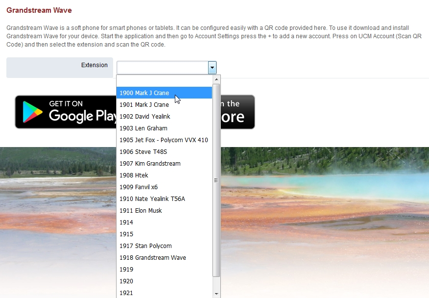
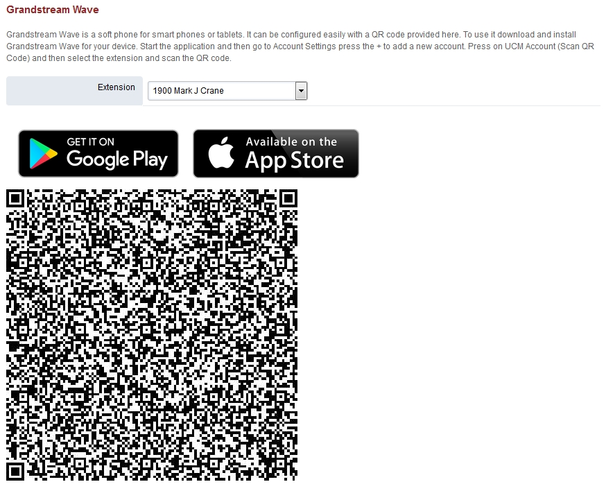

##################
GS Wave
##################

Grandstream Wave is a soft phone for smart phones or tablets. It can be configured easily with a QR code provided in your FusionPBX installation.

* To use it download and install Grandstream Wave for your mobile device.
* Start the Grandstream Wave application on your mobile device.
* Then go to the Grandstream Wave Account Settings and press the plus+ to add a new account.
* Press on UCM Account (Scan QR Code) and then select the extension and scan the QR code.

You can choose any extension to provision the Grandstream Wave.  Even If the extension is assigned to a desk phone.  Just be sure to enable multiple registrations.

.. note::

       Be sure to assign a user to an extension for this application to be fully functional. This is a new app starting with master branch version 4.5
       

