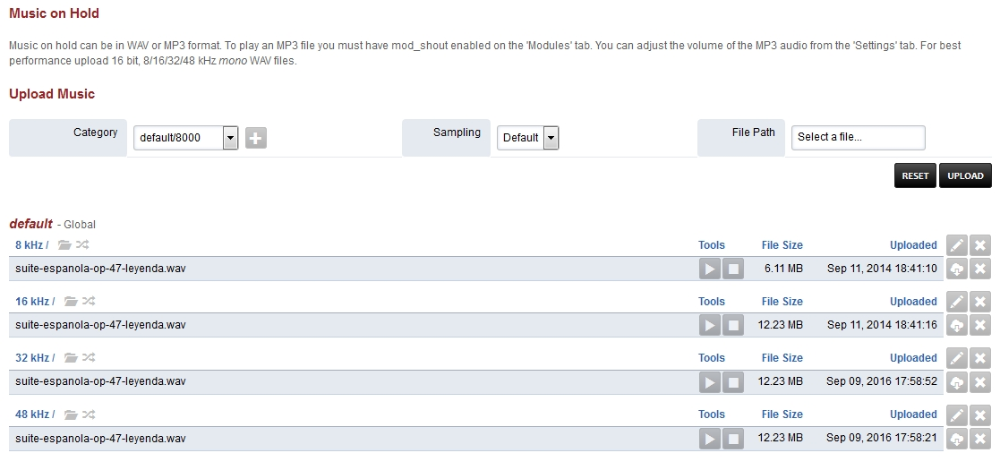

# Music on Hold

Music on hold can be in WAV or MP3 format. To play an MP3 file you must
have mod[shout]{#shout} enabled on the \'Modules\' tab. You can adjust
the volume of the MP3 audio from the \'Settings\' tab. For best
performance upload 16 bit, 8/16/32/48 kHz mono WAV files.

-   Click the edit pencil on the right to customize music on hold
    options. This can be done on each kHz group.

-   **Name:** Choose a name. (default is needed for the defauly Music on
    Hold.)
-   **Path:** Path to where the music is.
-   **Shuffle:** True or False (If true and multiple music files will
    shuffle the play order.)
-   **Sampling:** The rate the music is encoded in.
-   **Channels:** Mono or Stereo.
-   **Interval:** Silence between files playing in milliseconds.
-   **Timer Name:** Best to keep as soft.
-   **Chime File:** The file you want to \"chime in\" while Music on
    Hold is playing.
-   **Chime Frequency:** Seconds between each \"chime in\".
-   **Chime Maximum:** Max number attempts to \"chime in\".
-   **Domain:** Select Global for all domains or the specific domain for
    only that domain.

## Music on Hold Tips

-   When a new music on hold category mod[local_stream]{#local_stream}
    will be restarted. If it is busy then it will not restart
    automatically. A manual restart of the module is required when it is
    not in use. The module can be restarted from the Menu -\> Advanced
    -\> Modules or from the console and fs[cli]{#cli} with following
    command.

<!-- -->

    reload mod_local_stream

-   Each music on hold category is given a name. If the domain is set to
    global the name will be the name in the example below the protocol
    that is used is local[stream]{#stream} and the music on hold
    category is default and domain is set to global.

<!-- -->

    local_stream://default

-   It is possible that a domain or tenant can have its own category of
    music. In this example the name is \'custom\' and the domain was
    assigned automatically to the current domain.

<!-- -->

    local_stream://domain_name/custom

# Setting Up Custom Music on Hold in FusionPBX 5.3

### Step 1: Add Music on Hold​ Log in to the FusionPBX web interface.

- Navigate to Applications \> Music On Hold.

- Click the Add button in the top-right corner of the screen.

- If you want to upload a file to an existing category, select that
category. Otherwise, click the +button to create a new MOH category.

- Enter a name for the new category (if creating one).

- Leave the dropdown set to \"Default.\"

- Select a file to upload.

- Click the Upload button. (Large files may take a moment to upload.)

- Your new category and file will appear in the list.

### Step 2: Reload the Music on Hold Module (for New Categories)​ If you created a new category, follow these steps:

- SSH into your server and run the following commands:

- fs[cli]{#cli} This command opens the FreeSwitch CLI

- reload mod[local_stream]{#local_stream} This command reloads the new
category

- Press Ctrl+D to exit the CLI.

- Type exit to close the SSH session.

### Step 3: Assign Custom MOH to an Extension​ Navigate to Accounts \> Extensions.

- Select the extension you want to apply the custom MOH to.

- Find the \"Hold Music\" option and select your new custom group.

- Click Save to save your changes.

### Step 4: Verify Custom MOH​ 

- Test your custom MOH by calling the extension and placing it on hold.

- You should hear your custom MOH playing.
