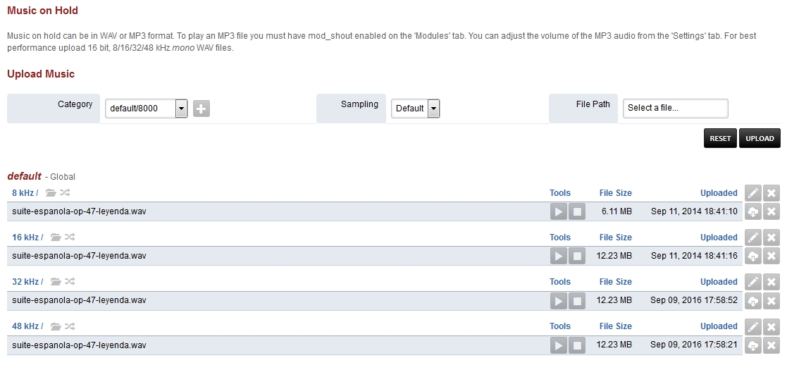
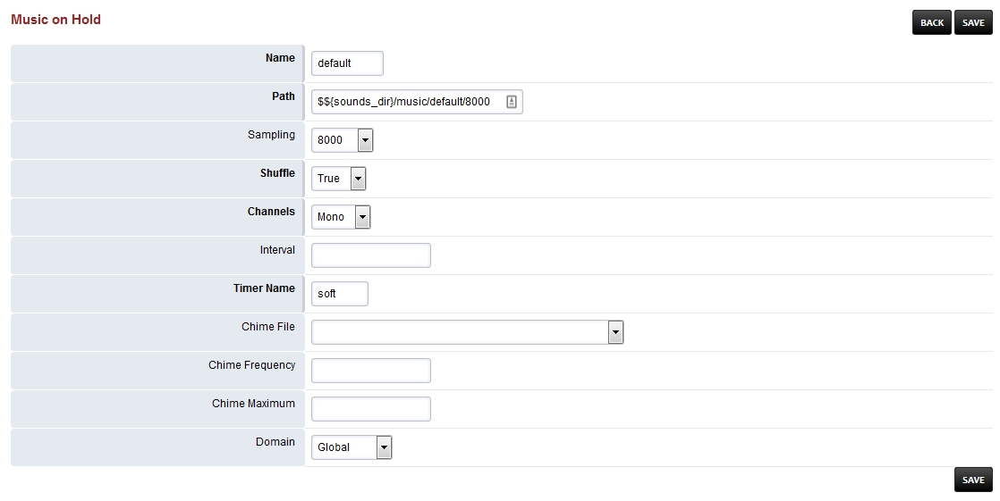

################
Music on Hold
################

Music on hold can be in WAV or MP3 format. To play an MP3 file you must have mod_shout enabled on the 'Modules' tab. You can adjust the volume of the MP3 audio from the 'Settings' tab. For best performance upload 16 bit, 8/16/32/48 kHz mono WAV files.

*  Click the edit pencil on the right to customize music on hold options.  This can be done on each kHz group. 

* **Name:** Choose a name. (default is needed for the defauly Music on Hold.)
* **Path:** Path to where the music is.
* **Shuffle:** True or False (If true and multiple music files will shuffle the play order.)
* **Sampling:** The rate the music is encoded in.
* **Channels:** Mono or Stereo.
* **Interval:** Silence between files playing in milliseconds. 
* **Timer Name:** Best to keep as soft.
* **Chime File:** The file you want to "chime in" while Music on Hold is playing.
* **Chime Frequency:** Seconds between each "chime in".
* **Chime Maximum:** Max number attempts to "chime in".
* **Domain:** Select Global for all domains or the specific domain for only that domain.

Music on Hold Tips
^^^^^^^^^^^^^^^^^^^

* When a new music on hold category mod_local_stream will be restarted. If it is busy then it will not restart automatically. A manual restart of the module is required when it is not in use. The module can be restarted from the Menu -> Advanced -> Modules or from the console and fs_cli with following command.

::

 reload mod_local_stream

* Each music on hold category is given a name. If the domain is set to global the name will be the name in the example below the protocol that is used is local_stream and the music on hold category is default and domain is set to global.

::

 local_stream://default

* It is possible that a domain or tenant can have its own category of music. In this example the name is 'custom' and the domain was assigned automatically to the current domain.

::

  local_stream://domain_name/custom

