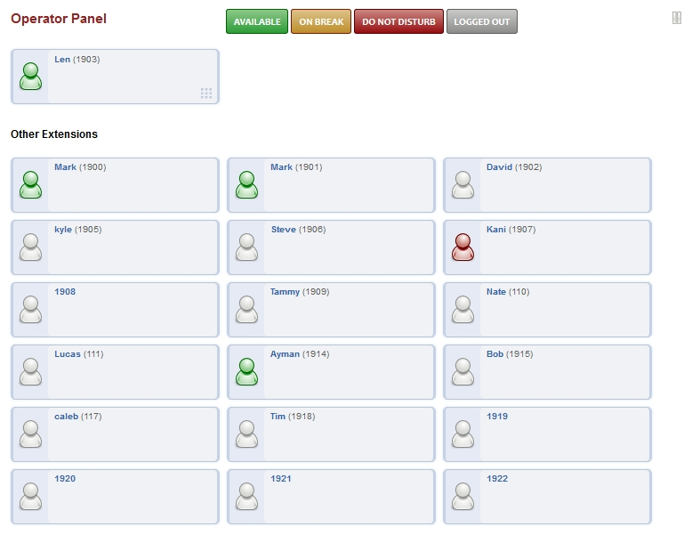

################
Operator Panel
################

Operator Panel is a simple and easy way to use the FusionPBX web interface to:

* Make calls from.
* See who is on a call.
* Eavesdrop on a call.
* Hangup your own call.
* Drag and drop blind transfer an active call.
* Drag and drop calling to other users.
* Login and out of queues and call center.

You can see the status of other users also depending on what permissions are set to the user.

        

.. note::

       Make sure in Accounts > Extensions that the extension is assigned to the user.  This will enable Operator Panel for that user.

Operator Panel Status
^^^^^^^^^^^^^^^^^^^^^^^

*  **Available:** The user will receive a call.
*  **On Break:** The user won't receive a call but can still receive a call from other users that directly call.
*  **Do Not Disturb:** The user won't receive any calls.
*  **Logged Out:** The user won't receive any calls as they are logged out.

