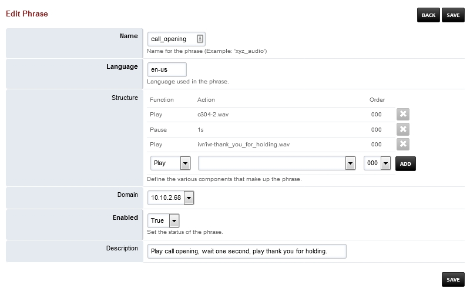

##########
Phrases
##########

Create phrases of audio files to be played in sequence. 

.. image:: ../_static/images/fusionpbx_phrases.jpg
        :scale: 85%

*  Click the **plus** on the right to create a phrase and the **pencil** icon to edit a phrase

* After modifying an existing phrase you may need to go to ``Status > SIP Status`` and click **Flush Cache** in the top right to apply.
