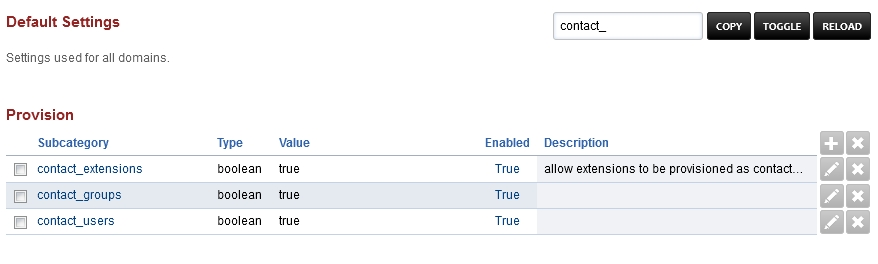

************
Provision
************

Automatic
^^^^^^^^^^

Auto provisioning is disabled by default. This is to give a chance to secure provisioning server with HTTP Authentication or CIDR. HTTP Authentication requires the phone to send hash of the combined username and password in order to get configuration. CIDR is an IP address restriction that can be used to restrict which IP addresses are allowed to get the device configuration. An example of CIDR is xxx.xxx.xxx.xxx/32 the /32 represents a single IP address. To set one of these values go to Advanced > Default Settings and find the Provision category from there used the edit button to set a value. After this is done it is safe to set enabled equal to true.

*  `Yealink <http://docs.fusionpbx.com/en/latest/applications/provision/provision_auto_yealink.html>`_
*  `Polycom <http://docs.fusionpbx.com/en/latest/applications/provision/provision_auto_polycom.html>`_
*  `Cisco <http://docs.fusionpbx.com/en/latest/applications/provision/provision_auto_cisco.html>`_
*  `Fanvil <http://docs.fusionpbx.com/en/latest/applications/provision/provision_auto_fanvil.html>`_
*  `Grandstream <http://docs.fusionpbx.com/en/latest/applications/provision/provision_auto_grandstream.html>`_
*  `Htek <http://docs.fusionpbx.com/en/latest/applications/provision/provision_auto_htek.html>`_
*  `Zoiper <http://docs.fusionpbx.com/en/latest/applications/provision/provision_auto_zoiper.html>`_

Manual
^^^^^^^

How to setup the device using the phone's web interface.

*  `Yealink <http://docs.fusionpbx.com/en/latest/applications/provision/provision_manual_yealink.html>`_
*  `Polycom <http://docs.fusionpbx.com/en/latest/applications/provision/provision_manual_polycom.html>`_
*  `Cisco <http://docs.fusionpbx.com/en/latest/applications/provision/provision_manual_cisco.html>`_
*  `Fanvil <http://docs.fusionpbx.com/en/latest/applications/provision/provision_manual_fanvil.html>`_
*  `Grandstream <http://docs.fusionpbx.com/en/latest/applications/provision/provision_manual_grandstream.html>`_
*  `Htek <http://docs.fusionpbx.com/en/latest/applications/provision/provision_manual_htek.html>`_
*  `SNOM <http://docs.fusionpbx.com/en/latest/applications/provision/provision_manual_snom.html>`_
*  `Zoiper <http://docs.fusionpbx.com/en/latest/applications/provision/provision_manual_zoiper.html>`_

Advanced > Default Settings
^^^^^^^^^^^^^^^^^^^^^^^^^^^^

In the `Provisioning section`_, there are a few key options that have to be set in order to turn auto provisioning on.

* **enabled** Must be enabled and set to **value true** and **enabled True**.  It is disabled by default.
* **http_auth_username** Must be enabled and set to **value true** and **enabled True**.  It is disabled by default. Be sure to use a strong username.
* **http_auth_password** Must be enabled and set to **value true** and **enabled True**.  It is disabled by default. Be sure to use a strong password.
* **cidr** Optional security option to allow configuration request limited to specific IP version 4 ranges. Type array allows multiple ranges of IP addresses.

Phone Screen Capture
^^^^^^^^^^^^^^^^^^^^^

* `Screen Capture <http://docs.fusionpbx.com/en/latest/applications/provision/phone_screen_capture.html>`_

.. Note::
       `Click here to view how to add a device <http://docs.fusionpbx.com/en/latest/accounts/devices.html>`_.

Phone Book
^^^^^^^^^^^^

Remote phone book (Address Book) are based on the FusionPBX `Contacts App </en/latest/applications/contacts.html>`_.

Phone Book Settings
~~~~~~~~~~~~~~~~~~~~

In order to use the phone book a few steps are needed.

* Assign the device to a user.
* Create or import the `Contacts </en/latest/applications/contacts.html>`_.

* Set **Enabled** as **True** in `Default Settings </en/latest/advanced/default_settings.html>`_.

* Set **Enabled True** for contact_extensions, contact_users and contact_groups in `Default Settings </en/latest/advanced/default_settings.html>`_.

* From the phone, go into the menu to update the phone book.

.. _Provisioning section: /en/latest/advanced/default_settings.html#id17
