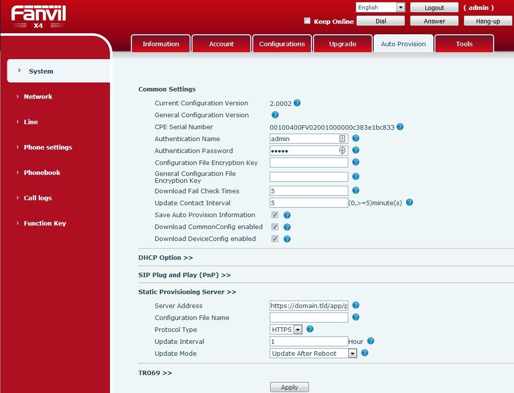
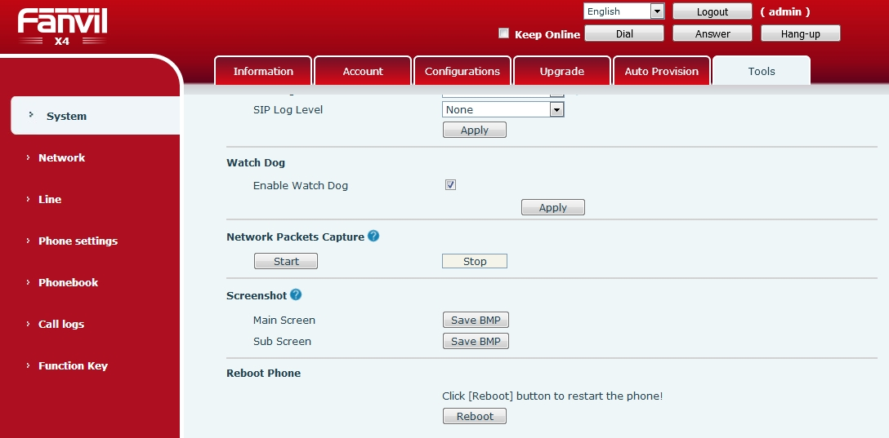
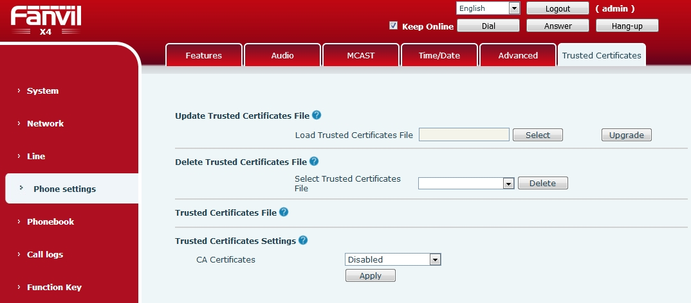

#########
Fanvil 
#########

Setting up a **Fanvil** SIP phone through the phone's local http management portal. 

* Factory reset the phone (physically on the phone) by pressing menu button > Settings > Advanced Settings (default password is 123) > Reset to Default > Press yes to continue.
* Press Menu > Status to get the phones ip address
* Open a web browser and enter the phones ip address
* Default login name and password is **admin**
* Top menu click **Auto Provision**

Common Settings
----------------

* Fill out the fields:

  * Authentication Name: http user name that was set in FusionPBX default settings
  * Authentication Password: http password that was set in FusionPBX default settings
  * Save Auto Provision Information: Check the box
  * Download CommonConfig enabled: Check the box
  * Download DeviceConfig enabled: Check the box

Static Provisioning Server
---------------------------

* Fill out the fields:

  * Authentication Name: http user name that was set in FusionPBX default settings
  * Server Address: https://domain.tld/app/provision
  * Protocol Type: HTTPS
  * Update Mode: Update after Reboot

* Click Apply

* Left side menu click **System**
* Top menu click **Tools**
* Scroll to the bottom and click **Reboot**

Self Signed Certificates
-------------------------

If you are going to use a self signed certificate you will need to adjust additional settings.

* Left side menu click **Phone settings**
* Top menu click **Trusted Certificates**
* CA Certificates: Disabled
* Click Apply

