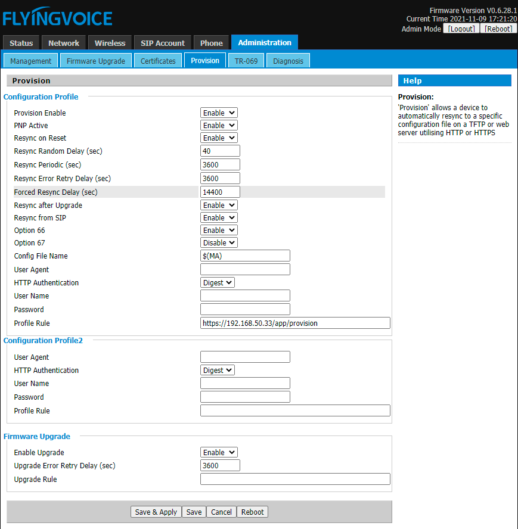

Flyingvoice 
============================

To configure the Flyingvoice phone do the following steps.

* Once the phone powers up, press the OK button once and the phone will display its IP address on the screen.  Navigate to that IP on another device in a web browser, and use admin for the username and admin for the password.
* Click the **Administration** tab at the top
* Click the **Provision** tab at the top secondary menu.
* Under **Configuration Profile**, fill in the **Profile Rule** field.  This will be https://domain.tld/app/provision  Replace domain.tld with your actual domain name.
* Click **Save & Apply.**

