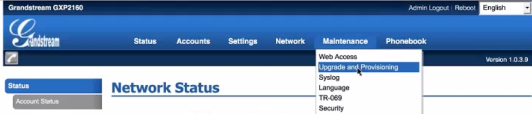
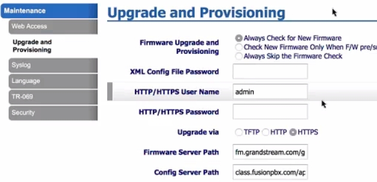
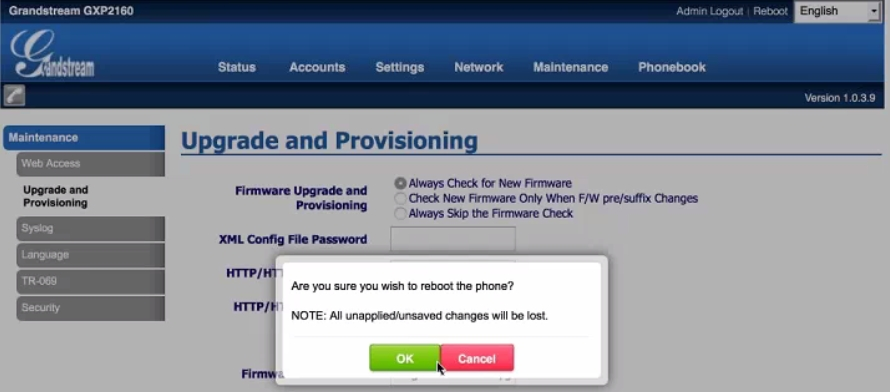

Grandstream
============

Auto provisioning with FusionPBX and Grandstream.

* Top Menu > Maintenance > Upgrade and Provisioning.

Fill in the following fields:

* **HTTP/HTTPS User Name:** Set in Advanced > Default Settings > Provisioning section in your FusionPBX installation.

* **HTTP/HTTPS Password:** Set in Advanced > Default Settings > Provisioning section in your FusionPBX installation.

* **Config Server Path:** This is typically your FusionPBX installation url/app/provision. (**sub.domain.tld/app/provision**)

* **Firmware Server Path:** Set in Advanced > Default Settings > Provisioning section in your FusionPBX installation.

* Click **Save and Apply** at the bottom.
.. note::

 Generally with provisioning, if there is an option like Grandstream has for a box or radio button to choose https or http then it is not needed to type http:// or https:// in the config url.

* Once you have the proper information filled in, click the **Reboot** option at the top right.

* Click **OK**

Troubleshooting
-----------------------

* Make sure provisioning is **enabled** in Advanced > Default Settings

* Check, double check that the correct extension number and password is being used.

* Factory default the phone and try again.

* Reboot the device.

* Check Fail2ban and see if the ip got blocked.

* Make sure you have created an DNS A record for the domain being used and there are no typos

* Nat, firewalls and router settings. Some brands of routers can cause issues. Google the make and model of router or firewall appliance for common settings or remedies.

* Visit Grandstream Supoprt http://www.grandstream.com/support

