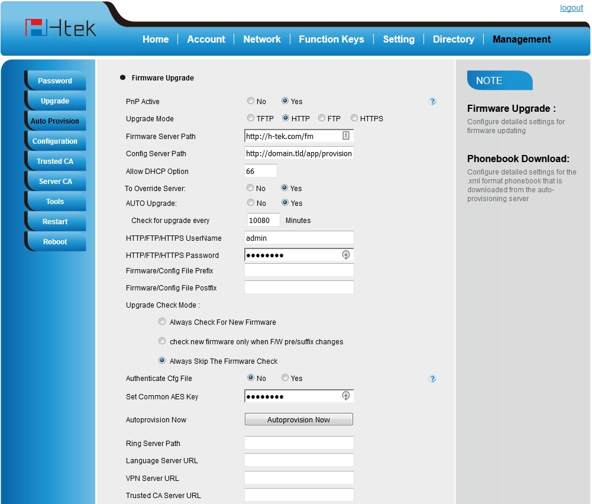
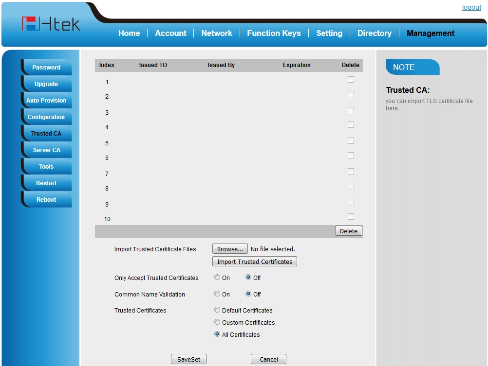

#########
Htek 
#########

Setting up a **Htek** SIP phone through the phone's local http management portal. 

* Factory reset the phone (physically on the phone) by pressing menu button > Settings > Advanced Settings (default password is admin) > Phone Settings > Factory Reset > Press yes to continue.
* Press Menu > Status > Information to get the phones ip address
* Open a web browser and enter the phones ip address
* Default login name and password is **admin**
* Top menu click **Management**
* Left menu click **Auto Provision**

* Fill out the following fields:

  * Firmware Server Path: 
  * Config Server Path:
  * HTTP/FTP/HTTPS UserName:
  * HTTP/FTP/HTTPS Password:
    
* Click **SaveSet**
* Click **Autoprovision Now**

Self Signed Certificates
-------------------------

Some additional settings need adjusted to provision with a self signed certificate.

* Top menu click **Management**
* Left menu click **Trusted CA**
* Choose the following
   * Only Accept Trusted Certificates: OFF
   * Common Name Validation: OFF
   * Trusted Certificates: All Certificates 

