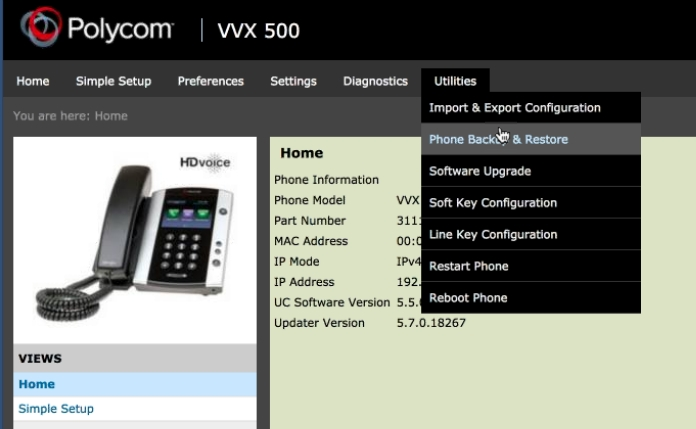
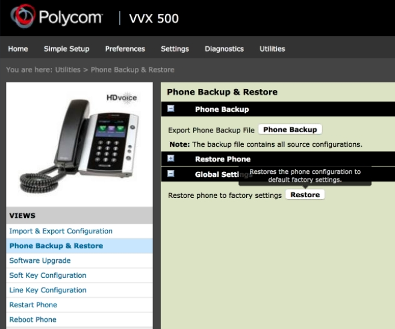
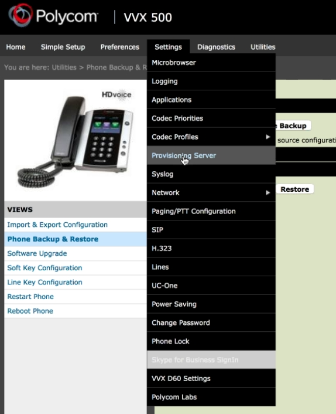
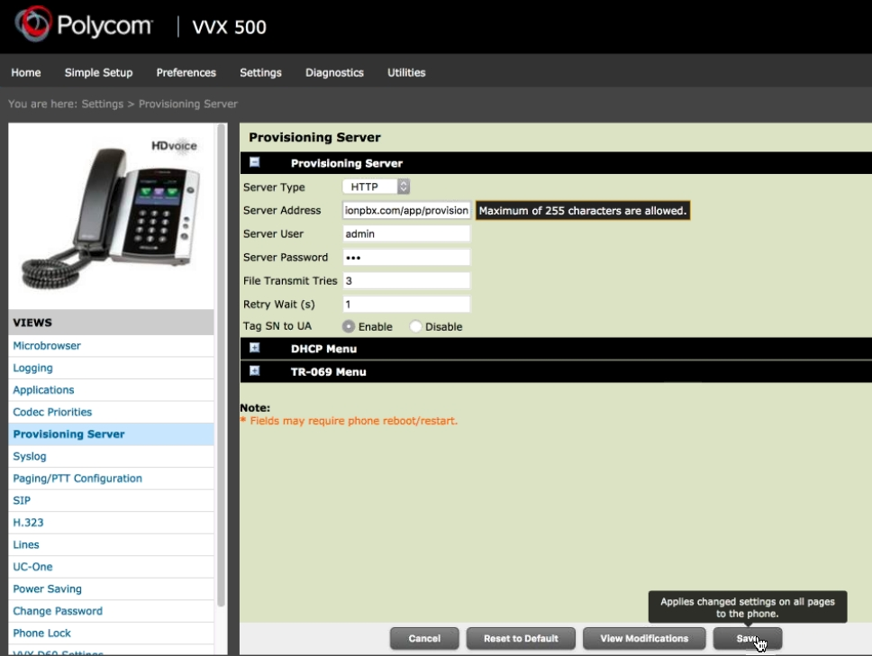

Polycom
============================

To auto provision Polycom

* Login to the phone. (Default user is admin and default password is 456)
* Go to the top menu an choose Utilities > Phone backup & restore. (Always good to start with factory defaults)

* Click The plus to the left of Global Settings then click **Restore.**

* Login to the phone again.
* Click Settings > Provisioning Server.

* Choose the **Server Type** as http.  (If you have ssl certificate that polycom approves then choose https instead.)
* Fill in the **Server Address** field.  This will be domain.tld/app/provision  Replace domain.tld with your actual domain name
* Fill in **Server User and Password** fields.
* Choose **Enable on **Tag SN to UA**
*  Click **Save** to Provision the Polycom.  You should hear a tone meaning the phone reached out to the server and provisioned.

