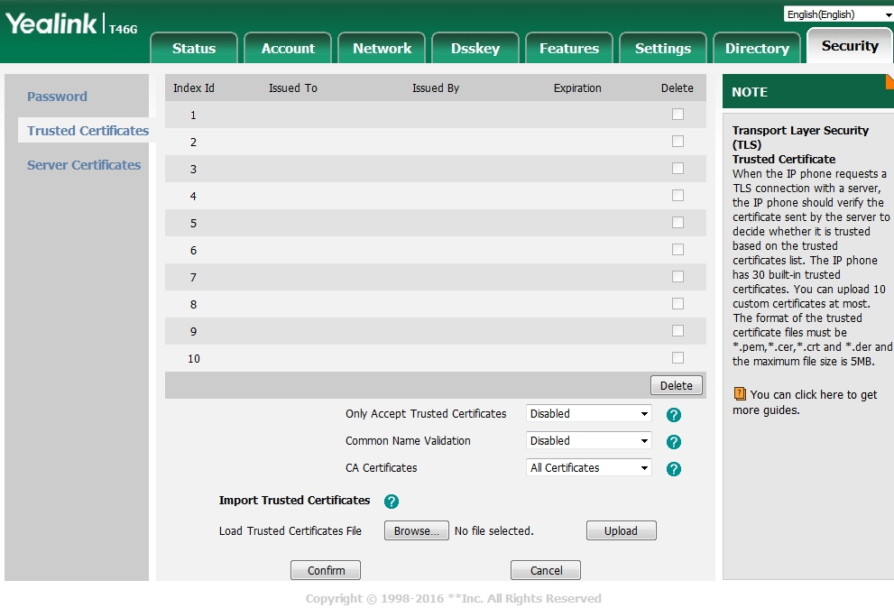
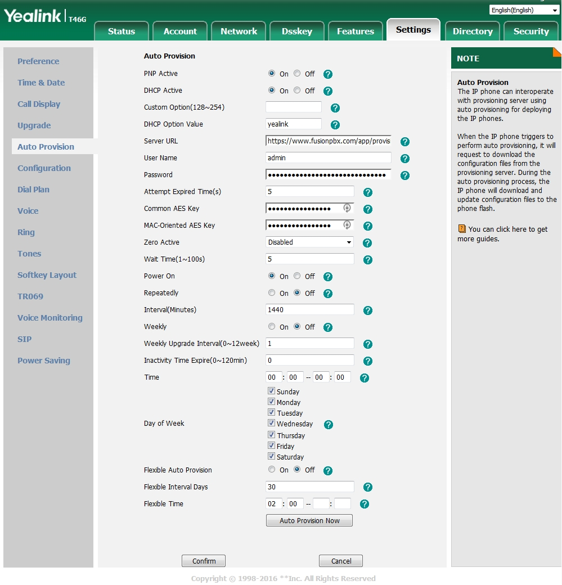

Yealink 
============================

To auto provision Yealink

* Login to the phone
* Goto the Security tab at the top right
* On the left vertical menu click **Trusted Certificates**
* On the dropdown box near the bottom choose **Disabled** for "Only Accept Trusted Certificates".  If you have a Certificate that is not self-signed and Approved by Yealink and installed on your FusionPBX server, you can keep this enabled
* Click **Confirm**

Once you have that done

* Click the **Settings** tab at the top
* On the left vertical menu click  **Auto Provision**
* Fill in the **Server URL** field.  This will be https://domain.tld/app/provision  Replace domain.tld with your actual domain name
* Click **Confirm** at the bottom
* Click **Auto Provision Now** at the bottom

