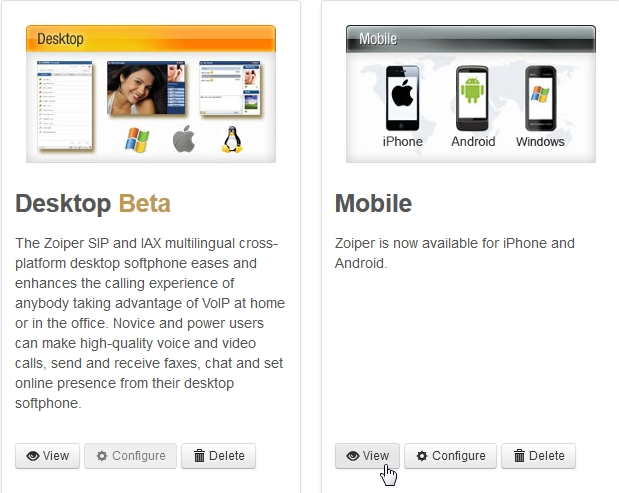

# Zoiper

  QR and app provisioning with Zoiper

  This menu add-on will enable the abliity to do QR provisioning from
  IOS or android Zoiper app. Zoiper has designed the process in a way
  that is cross platform. Fusionpbx has the ability to click the
  extension you want to provision and a link wil open to either download
  the app on multiple platforms or if you have the app installed on a
  mobile device you can use the QR code scanner to scan a QR image and
  the mobile is ready to use.

  We will walk through the process

## Zoiper.com account setup

  There are two parts to make this function. <http://oem.zoiper.com> and
  Fusionpbx menu add-on.

  This all adds a one-click install for both the Desktop and Mobile
  Zoiper APPs in the User Portal. The page is accessible by end users.

  This can be done with the FREE Zoiper OEM account or can use the paid
  versions for more customization like branding.

-  Go to: <https://oem.zoiper.com/>
-  Sign up for Login
-  Configure your Desktop and Mobile Apps with the information you
   want.
-  Then click \"CONFIGURE\" Under Desktop.
-  This will give you a LINK with a PAGE ID:(32 character)   
   -  <https://www.zoiper.com/en/page/MYPAGEID?u=&h=&p=&o=&t=&x=&a=&tr=>\"   
-  Copy the page ID

<br>

## Zoiper menu add-on for Fusionpbx

On your server

```
    cd /var/www/fusionpbx/app
    git clone https://github.com/fusionpbx/fusionpbx-app-zoiper.git zoiper
    chown -R www-data:www-data /var/www/fusionpbx/app/zoiper
```

-  Log into the FusionPBX webpage
-  Advanced -\> Upgrade
-  Menu Defaults and Permission Defaults.
-  Log out and back in

<br>

**Advanced** -> **Default Settings**

>**Note:** **MYPAGEID** and **provider_id** are two different sets of   
>characters. You can also find these by going into the oem.zoiper.com   
>login and click \"view\" on the moblie section.



 ### provider_id

```
    provider_id
    The Do It Yourself way: make your own page with instructions

    If you want to customize this page, you can do so, just make sure to embed this html code on your website:
    >>>>>>09876543210987654321098765432199<<<<<<<&u=&h=&p=&o=&t=&x=&a=&tr=" alt="QR image"  />
```

 ### MYPAGEID

```
    MYPAGEID
    The easy way: send your customers to our landing page
    Add a link on your website to this step by step tutorial on our website : (**click here** to see it in action).
    <a href="https://www.zoiper.com/en/page/>>>>>>>>c1234567890123456789012345678901<<<<<<<?u=&h=&p=&o=&t=&x=&a=&tr=">Configuration instructions for Android and iOS</a>


     Goto Advanced -> Default Settings
     Add a Default Setting

     Category: zoiper
     Subcategory: page_id
     Type: text
     Value: (32 character MYPAGEID)
     Enabled: True
     Save


    Category: zoiper
    Subcategory: provider_id
    Type: text
    Value: (32 character provider_id)
    Enabled: True
    Save
```

-  Goto Apps -> Zoiper
-  Superadmin will see a list of ALL USER EXTENSIONS
-  Users will only see the extensions assigned to them.

Click on a link and it will take you to the Zoiper Site. Follow   
instructions there to download and install.
  
