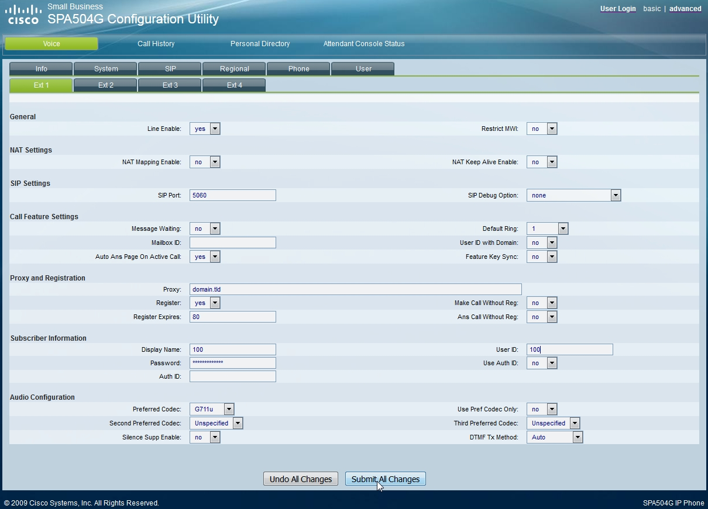
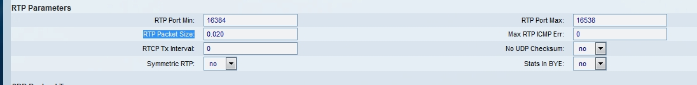

########
Cisco
########

To manually provision Cisco

* Login to the phone
* Goto the **Ext1** top left tab
* **Proxy and Registration** section put your servers *domain.tld* in the *proxy* field
* **Subscriber Information** section put the extension number for *Display Name* and *User ID*
* **Password** put the *extensions password* 
* Click **Submit All Changes** at the bottom

Once you have that done, make sure the p-time is set to 0.020

* Click the **advanced** option at the top right
* Goto the **SIP** tab at the top
* Scroll down to the **RTP Parameters** section and make sure the *RTP Packet Size* field has *0.020*
* Click **Submit All Changes** at the bottom

**HTTP Authentication**

Phone web interface -> Provision - > Profile Rule

[--uid myUser --pwd myPass]http://mydomain.com/app/provision/?mac=$MA
