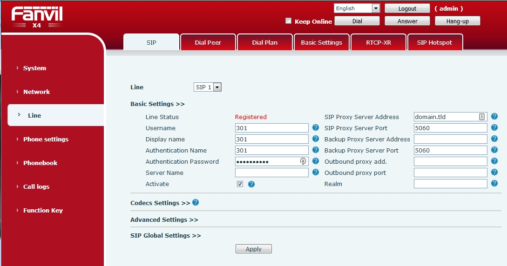
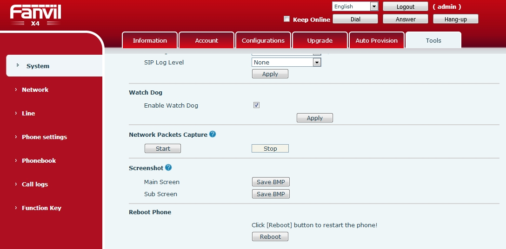

#########
Fanvil 
#########

Setting up a **Fanvil** SIP phone through the phone's local http management portal. 

* Factory reset the phone (physically on the phone) by pressing menu button > Settings > Advanced Settings (default password is 123) > Reset to Default > Press yes to continue.
* Press Menu > Status to get the phones ip address
* Open a web browser and enter the phones ip address
* Default login name and password is **admin**
* Left side menu click **Line**
* Fill out the fields:

  * Username:
  * Display Name:
  * Authentication Name:
  * Authentication Password:
  * SIP Proxy Server Address:
  
* Click Apply

* Left side menu click **System**
* Top menu click **Tools**
* Scroll to the bottom and click **Reboot**

