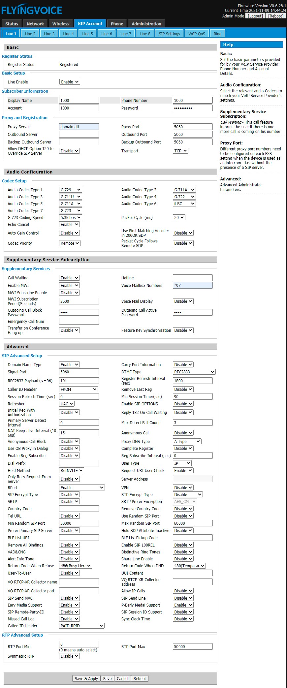

#########
Flyingvoice 
#########

Setting up a **Flyingvoice** SIP phone through the phone's local http management portal. 

* Once the phone powers up, press the **OK** button once or **Menu** > **Status** and the phone will display its IP address on the screen.  Navigate to that IP on another device in a web browser, and use **admin** for the username and **admin** for the password.

* **Enter the following information for each Account that is required:**
* Click the **SIP Account** tab at the top menu.
* Click the **Line 1** tab at the top secondary menu.
* Set **Line Enable** to enabled.
* Set **Display Name** to the user's name or the extension number, or both, ie "1000".
* Set **Account** to the users FusionPBX extension number, in this case 1000.
* Set **Phone Number** to the users FusionPBX extension number, in this case 1000.
* Set **Password** to the users FusionPBX password.
* If you would like to use TCP transport, set **Trasport** to TCP.
* Under **Proxy and Registration**, set the **Proxy Server** to your FusionPBX domain for that extension.
* Set **Voice Mailbox Numbers** to *97
* Click **Save & Apply.**

