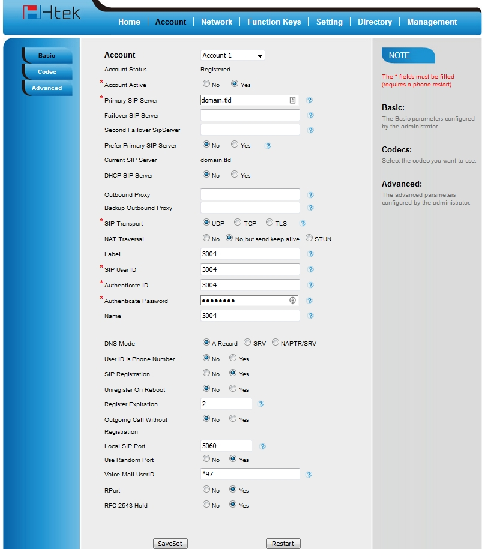

#########
Htek 
#########

Setting up a **Htek** SIP phone through the phone's local http management portal. 

* Factory reset the phone (physically on the phone) by pressing menu button > Settings > Advanced Settings (default password is admin) > Phone Settings > Factory Reset > Press yes to continue.
* Press Menu > Status > Information to get the phones ip address
* Open a web browser and enter the phones ip address
* Default login name and password is **admin**
* Top menu click **Account**
* Fill out the fields with **red*** :

  * Account Active:
  * Primary SIP Server:
  * SIP Transport:
  * SIP User ID:
  * Authenticate ID:
  * Authenticate Password:
  
* Click SaveSet
* Click Restart

