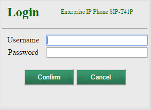
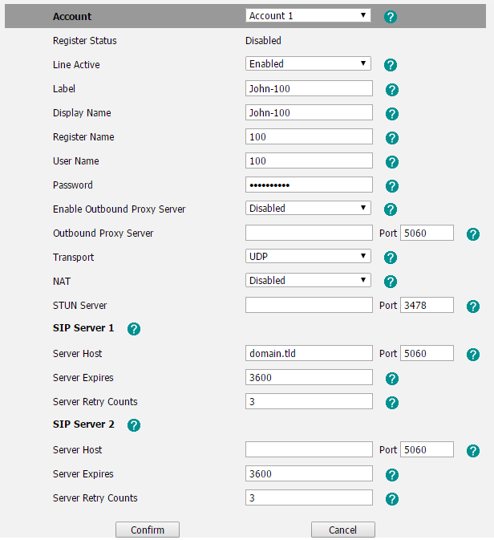

#########
Yealink 
#########

Setting up a **Yealink** SIP phone through the phone's local http management portal. 

* Factory reset the phone by holding down the "OK" button, found in the center of the up/down left/right buttons, until the phone prompts to Factory reset.  Press the softkey for "OK" to continue.  The phone will factory reset and reboot.

* Once the phone powers up, press the OK button once and the phone will display its IP address on the screen.  Navigate to that IP on another device in a web browser, and use admin for the username and admin for the password.

* **Enter the following information for each Account that is required:**
* Select the "Account" tab at the top menu.
* Set "Line Active" to enabled.
* Set "Label" to the user's name or the extension number, or both, ie "John-100".
* Set "Display Name" to the same as above.
* Set "Register Name" to the users FusionPBX extension number, in this case 100.
* Set "User Name" to the users FusionPBX extension number, in this case 100.
* Set "Password" to the users FusionPBX password.
* If you would like to use TCP transport, set "Trasport" to TCP.
* Under SIP Server 1, set the "Server Host" to your FusionPBX domain for that extension.
* **Click confirm.**

* Click "Advanced" on the left menu.
* Set "Voicemail" to *97
* **Click confirm.**
