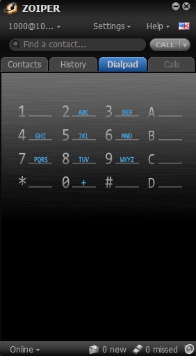
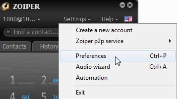
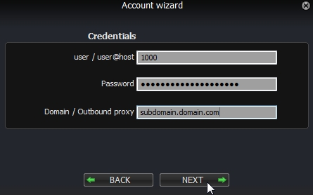
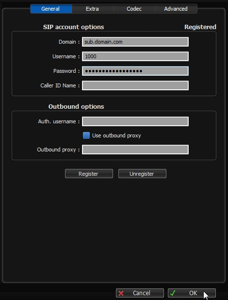

Zoiper
=======

Registering an **Extension** using the softphone Zoiper.

|

In the ever changing world of voip businesses are moving away from hardware phones.  From call centers, to home offices, Zoiper and many other softphones make use of software for communication needs for not only voice. but also for video and faxing. This example will show how to register an extension using Zoiper for Windows. *Note* Zoiper can be used on several operating systems and mobile devices.

|
1. Download the software. .. Zoiper: http://www.zoiper.com/
2. Install the software.
3. If the software isn't open click the Zoiper icon to open from the desktop or start menu.

.. image:: ../../_static/images/fusionpbx_zoiper.jpg
        :scale: 85%

|

4. Click on **Settings**

|

5. Click on **Preferences**

|

6. Click on **Create account**

|

7. Enter the user, password and domain name.

| ``user: 1000``
| ``password: thepassword``
| ``domain: sub.domain.com``

|

|

8. Click ok.  You should have **Registered** at the top right

|

- Troubleshooting tips

|

* Check, double check that the correct extension number and password is being used.
* Check Fail2ban and see if the ip got blocked.
* Make sure you have created an DNS A record for the domain being used and there are no typos
* Nat, firewalls and router settings.  Some brands of routers can cause issues.  Google the make and model of router or firewall appliance for common settings or remedies.
* Visit Zoiper Community Supoprt http://community.zoiper.com/
