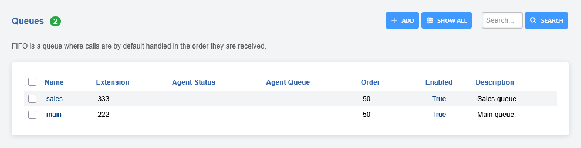
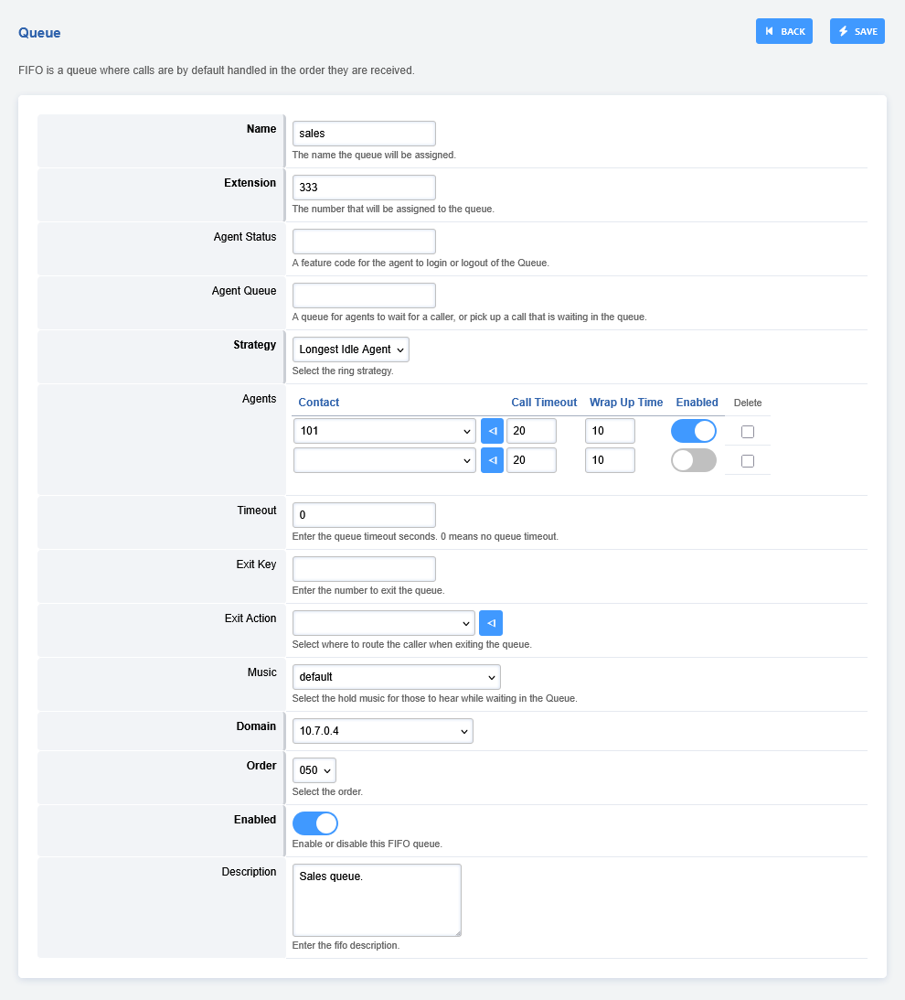

# Queues

Queues are used to setup waiting lines for callers. Also known as FIFO
Queues.

The Queues feature is rarely used for call center type work. When
needed, [Call Center](call_center.html) is usually used instead.

