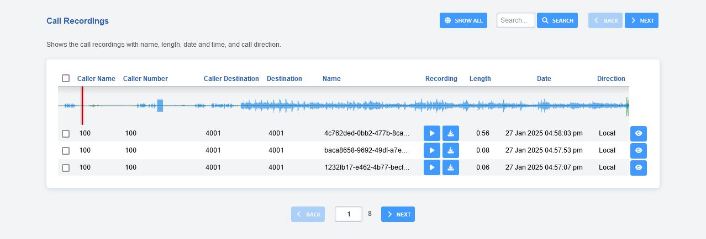
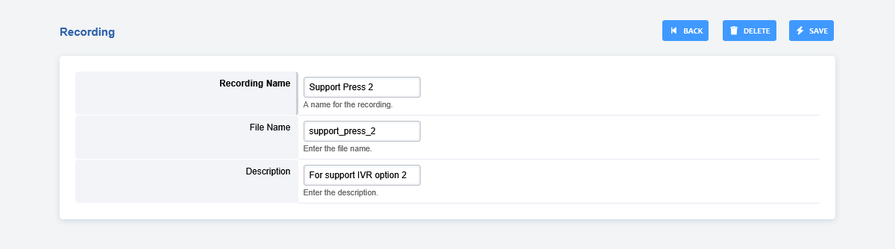

# Recordings

Recordings are sound files that can be used for the IVR Menu (Auto Attendant). They are managed from Application -> Recordings. From there, you can add, upload, rename, update, and delete recordings. If you set up [speech](../applications/speech.md) and [transcribe](../applications/transcribe.md), recordings can be created with text-to-speech or existing recordings can be transcribed.

---

Dial \*732 to create a recording, or upload a 16-bit
8khz/16khz mono WAV file. [Click here for the youtube
video.](https://youtu.be/CkqlsVvvv2U)

The PIN number that is required is displayed on the recordings page in the description. 

:::{note}

Pin number is recommended, but can be left empty if no pin number is desired, then pin_number=   
:::

## Create a Recording

1.  Dial \*732 and wait for the voice prompt
2.  Enter the password (pin_number) followed by the pound sign# 
   Enter at least a 3-digit number.  This will label the recording file. (recording100.wav)
3.  Start talking to make the recording after the voice prompt and press the pound key #
4.  Press 1 to accept the recording, then hang up or press 2 to start over.

## Edit Recording

1.  Click the edit pencil icon.
2.  Rename as needed.
3.  Click Save to save the changes.

## Applying Recordings

Once you have a recording made, you can use the recordings in different
areas of FusionPBX. Custom IVRs and phrases would be the typical
uses.

## Dialplan

To view or change the pin number, go to **Dialplan** > **Dialplan Manager** > Click on **Recordings** on the dialplan details page, look for the  **pin_number=** near the bottom.

## [Recordings Default Settings](/en/latest/advanced/default_settings.html#id24)

Click the link above for the Recordings default settings.
