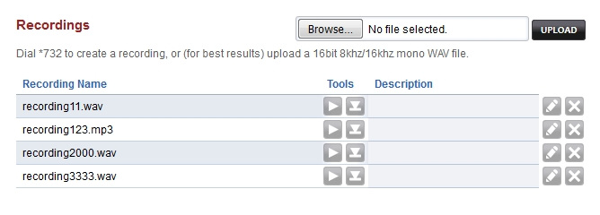
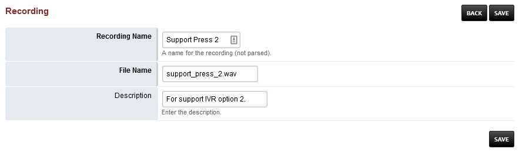

***********
Recordings
***********

Dial \*\732 to create a recording, or (for best results) upload a 16bit 8khz/16khz mono WAV file. `Click here for the youtube video.`_

.. raw:: html

    

    <iframe width="100%" height="350" src="https://www.youtube.com/embed/CkqlsVvvv2U?rel=0" frameborder="0" ; encrypted-media" allowfullscreen></iframe>
    

To view and set the pin number goto Dialplan > Dialplan Manager > Click on Recordings > pin_number=8675309 at the bottom.

.. note::

  Pin number is recomended but can be left empty if no pin number is desired then pin_number=

Create a Recording
-------------------

1. Dial \*\732 and wait for the voice prompt
2. Enter the password (pin_number) followed by the pound sign# 
   Enter at least a 3 digit number.  This will label the recording file. (recording100.wav)
3. start talking to make the recording after the voice prompt and press the pound key #
4. Press 1 to accept the recording then hang up or press 2 to start over.

Edit Recording
---------------

1. Click the edit pencil icon.
2. Rename as needed.
3. Click save to save the changes.

Applying Recordings
-------------------

Once you have a recording made you can use the recordings in different area's of FusionPBX.  Custom IVR's and phrases would be the typical uses.

`Recordings Default Settings`_
---------------------------------------

Click the link above for Recordings default settings.

.. _Recordings Default Settings: /en/latest/advanced/default_settings.html#id24

.. _Click here for the youtube video.: https://youtu.be/CkqlsVvvv2U
