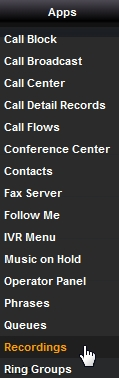

***********
Recordings
***********

|

Dial *732 to create a recording, or (for best results) upload a 16bit 8khz/16khz mono WAV file.

|

To view and set the pin number goto Dialplan > Dialplan Manager > Click on Recordings > pin_number=8675309 at the bottom.  

|

|

Create a Recording
-------------------

|

1. Dial *732 and wait for the voice prompt
2. Enter the passowrd (pin_number) followed by the pound sign# 
   Enter at least a 3 digit number.  This will label the recording file. (recording100.wav)
3. start talking to make the recording after the voice prompt and press the pound key #
4. Press 1 to accept the recording then hang up or press 2 to start over.

|

.. image:: ../_static/images/fusionpbx_recordings1.jpg
        :scale: 85%

|

Applying Recordings
-------------------

|

Once you have a recording made you can use the recordings in different area's of FusionPBX.  Custom IVR's and phrases would be the typical uses.

|
