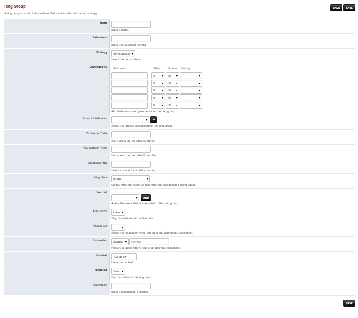

************
Ring Groups
************

|

A ring group is a set of destinations that can be called with a ring strategy.

To add a ring group click the plus. `Click for the youtube video <https://youtu.be/sULuuLOSvLQ>`_ .

.. image:: ../_static/images/fusionpbx_ring_group.jpg
        :scale: 85%

*  **Name** A meaningful name for this ring group. This name is used in th Destination select list.
*  **Extension** The extension number for this ring group.
*  **Greeting** Play a sound file upon calling the Ring Group extension.
*  **Strategy** The selectable way in which the destinations are being used.
*      **Simultaneous** Rings all destinations. Single threaded.
*      **Sequence**  Calls destinations in sequence where order that is lower goes first.
*      **Enterprise** Ring all destinatons. Multi-threaded.
*      **Rollover** Calls destinations in sequence and skips busy destinations.
*      **Random** A random destination will ring.
*  **Destinations** The extensions that this ring group applies to.
*  **Prompt** Where you determine if the call must have a dial to confirm before a pickup event.
*  **Caller ID Name Prefix** The string that is added to the caller ID when it displays on the ringing extension.
*  **Caller ID Number Prefix** The **Number** that is added to the caller ID when it displays on the ringing extension.
*  **Ring Back** What the caller hears when they are waiting for the **Destinations** to answer. (ex. Music on Hold, us-ring)
*  **Context** The context defaults to the domain name.

Ring Group Example
~~~~~~~~~~~~~~~~~~~~

In our example we will have 4 extensions all ring at the same time until one of them pick up first.  Click the + to create a ring group.  Fill in the fields that are in **bold**.  In the Extension box type a number that is **NOT** already created.  This new extention won't be in the extension list.  The strategy will be Simultaneous. Enter in the destination the 4 extensions 1001, 1002, 1003, 1004.

.. image:: ../_static/images/fusionpbx_ring_group2.jpg
        :scale: 85%

