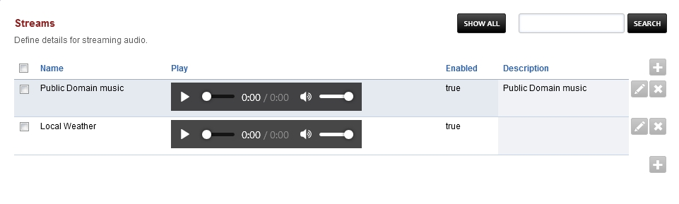
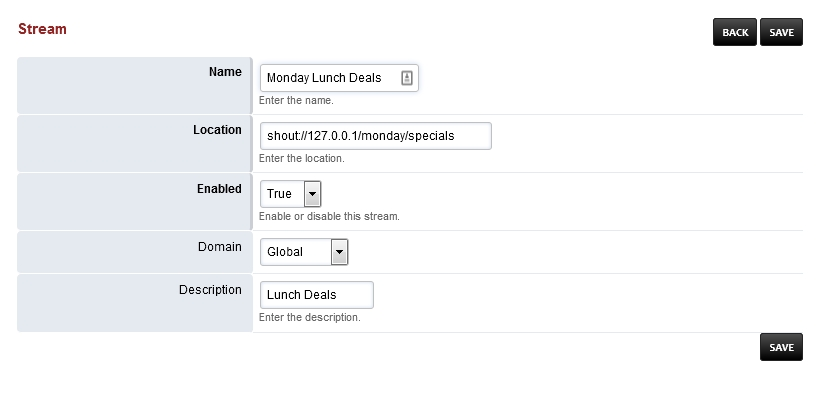

###########
Streams
###########

Define details for streaming audio.

* Make sure mod_shout is installed and is started.
* Have a shoutcast url ready to use. (shout://domain.tld/path/to/)
* To add a stream click the plus icon on the right
* Edit the fields:
 		* Name: Can be anything
		* Location: Must start with shout://
		* Enabled: If you want the stream enabled
		* Domain: Choose a domain that will only have the stream. Choose Global for all domains
		* Description: To help organize ;-)
		

.. Note::

 Editing a stream path will result in having to update anything that is using the stream.  For example, if you have extension 500 using stream "Local Weather" and you edit the shout:// path then you will have to go back to extension 500 and reset the music on hold for extension 500.  This is by design.

.. Warning::

  Please be aware of your countries copyright laws for streaming the content you are going to stream. 
	
