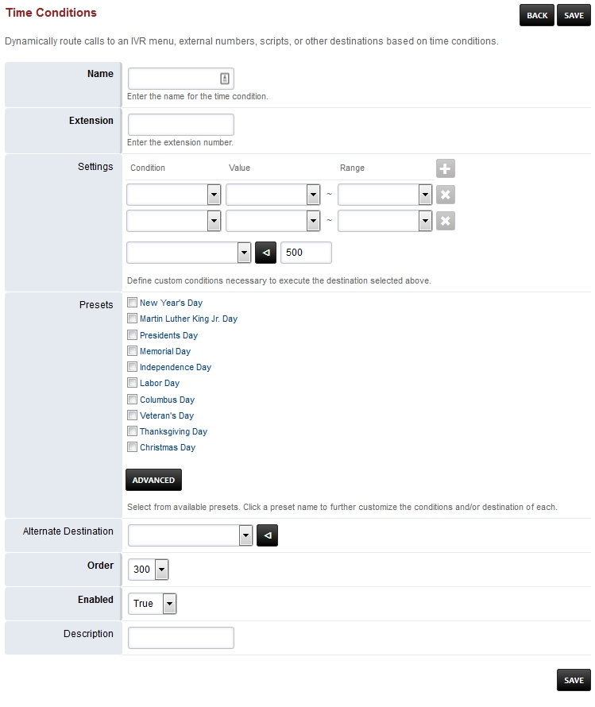
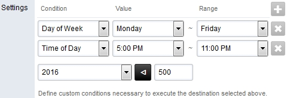

*****************
Time Conditions
*****************

Dynamically route calls to an IVR menu, external numbers, scripts, or other destinations based on time conditions.  Fields in **bold** are mandatory.

*  **Name** Name of the Time Condition.
*  **Extension** Define an extension number that is NOT allready created.
*  Presets US Holiday presets.
*  Alternate Destination If the condition doesnt match the call will goto the defined alternate destination.
*  **Order** Changes the order of which condition is evaluated first.
*  **Enabled**  If the ring group is enabled.

Time Conditions Example
~~~~~~~~~~~~~~~~~~~~~~~~

In our example we have an employee that will receive calls during a set time range and set days.  Below is what the settings look like for Monday through Friday at 5:00pm to 11:00pm.  If the employee doesnt answer the call will be directed to the **Timeout Destination**.  Label the **Name as Oncall** and invent the **Extension as 10011**.  In the **Settings** choose from the dropdown lists for *Day of Week* for the condition, *Monday* for the Value and *Friday* for the Range. Next set of dropdown list choose *Time of Day* for the condition, *5:00 PM* for the value and *11:00 PM* for the Range.  If other options are needed just click the + to the right of Range. 

The next dropdown choose the extension where the call is intended for.  If the call is outside the date and time specified the call will goto the **Alternate Destination** dropdown.  Be sure **Enabled** is set *True* and click save.

**Conditions**
~~~~~~~~~~~~~~~~~~~~~~~~

The most common conditions to use are **Day of Week** and **Time of Day**.

**Time of Day**

* Is a select list of every minute for the full 24 hour period of time.

**Hour of Day**

* Another alternative the Hour of Days. If you set a range of 9 - 4 it will include all of 4 until it changes to 5. 

**Day of Week**

The day of week condition each day of the week is represented by a number. A valid range is from low to high. A valid range is like Monday to Friday (2-6). 

*  1 Sunday
*  2 Monday
*  3 Tuesday
*  4 Wednesday
*  5 Thursday
*  6 Friday
*  7 Saturday

An example of an **invalid range** would be Saturday to Sunday **(7-1)**.

`Time Conditions Default Settings`_
---------------------------------------

Click the link above for Time Conditions default settings.

.. _Time Conditions Default Settings: /en/latest/advanced/default_settings.html#id30

