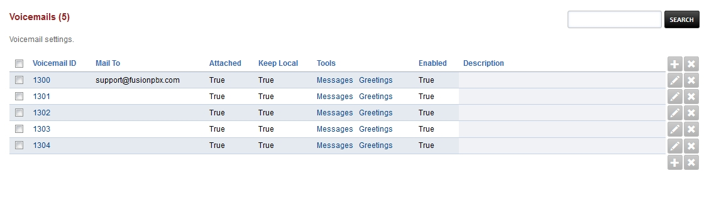

##########
Voicemail
##########

To edit voicemail settings click the pencil edit icon on the right of the extension number.

.. image:: ../_static/images/fusionpbx_voicemail1.jpg
        :scale: 85%

Voicemail Options
====================

Access an extensions voicemail **away** from the extension dial the extension and interupt the greeting with the ***star** key.

+-------------+-----------------------+------------------------------+-----------------------------------+
| ***97**     | To access **that** extensions voicemail **from the extension** or the voicemail button   |
+-------------+-----------------------+------------------------------+-----------------------------------+
| ***98**     | To access **any** extensions voicemail                                                   |
+-------------+-----------------------+------------------------------+-----------------------------------+
| ***99[ext]**| To access **a specific** extension voicemail                                             |
+-------------+-----------------------+------------------------------+-----------------------------------+

+-------------+-----------------------+
|             |   **Main Menu**       |
+-------------+-----------------------+
| **press 5** | For advanced options  |
+-------------+-----------------------+

+-------------+-----------------------+
|             | **Advanced Options**  |
+-------------+-----------------------+
| **press 1** | Record a greeting     |
+-------------+-----------------------+
| **press 2** | Choose a greeting     |
+-------------+-----------------------+
| **press 3** | Record name           |
+-------------+-----------------------+
| **press 6** | Change password       |
+-------------+-----------------------+
| **press 0** | For main menu         |
+-------------+-----------------------+

