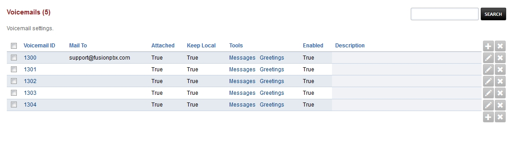
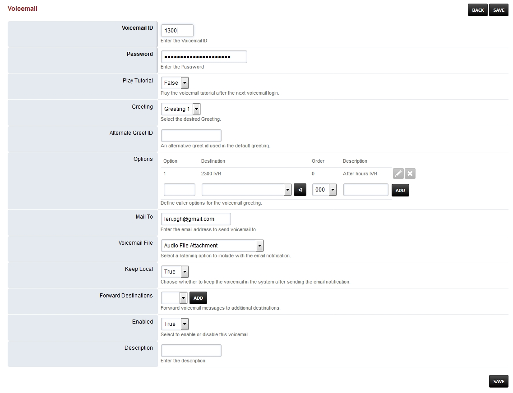

##########
Voicemail
##########

To edit voicemail settings click the pencil edit icon on the right of the extension number.

Here you can edit voicemail settings.

*  Play Tutorial- Play the voicemail tutorial after the next voicemail login
*  Greeting- When you dial ***97**, record a greeting and set a number you can choose which greeting to use
*  Alternate Greet ID- An alternative greet id used in the default greeting
*  Options- Define caller options for the voicemail greeting
*  Mail to- have voicemails emailed to this address
*  Voicemail File- Select a listening option to include with the email notification
*  Keep Local- Choose whether to keep the voicemail in the system after sending the email notification
*  Forward Destinations- Forward voicemail messages to additional destinations
*  Enabled- Enable or disable the voicemail box

.. note::

 Starting version 4.2 remote access to voicemail by interrupting the greeting message by pressing "*" and entering the password is disabled by default.

To enable remote access to voicemail

1. Go to your Fusionpbx installation menu.
2. Advanced.
3. Default Settings.
4. Voicemail category.
5. Enable and set true remote_access.

Voicemail Options
====================

To access an extensions voicemail **away** from the extension.

*  Dial the extension and interupt the greeting with the ***star** key.

+-------------+-----------------------+------------------------------+-----------------------------------+
| ***97**     | To access **that** extensions voicemail **from the extension** or the voicemail button   |
+-------------+-----------------------+------------------------------+-----------------------------------+
| ***98**     | To access **any** extensions voicemail                                                   |
+-------------+-----------------------+------------------------------+-----------------------------------+
| ***99[ext]**| To access **a specific** extension voicemail                                             |
+-------------+-----------------------+------------------------------+-----------------------------------+

+-------------+-----------------------+
|             |   **Main Menu**       |
+-------------+-----------------------+
| **press 5** | For advanced options  |
+-------------+-----------------------+

+-------------+-----------------------+
|             | **Advanced Options**  |
+-------------+-----------------------+
| **press 1** | Record a greeting     |
+-------------+-----------------------+
| **press 2** | Choose a greeting     |
+-------------+-----------------------+
| **press 3** | Record name           |
+-------------+-----------------------+
| **press 6** | Change password       |
+-------------+-----------------------+
| **press 0** | For main menu         |
+-------------+-----------------------+

`Email Setup/Default Settings <http://docs.fusionpbx.com/en/latest/advanced/default_settings.html#email>`_
^^^^^^^^^^^^^^^^^^^^^^^^^^^^^^^^^^^^^^^^^^^^^^^^^^^^^^^^^^^^^^^^^^^^^^^^^^^^^^^^^^^^^^^^^^^^^^^^^^^^^^^^^^^^^^^^
Click the link above for setting up email server settings.  These are the settings needed to enable your FusionPBX installation to be able to send email notifications.

`Voicemail Default Settings`_
^^^^^^^^^^^^^^^^^^^^^^^^^^^^^^^^^^^^^^

Voicemail default settings gives the options to adjust voicemail settings on your FusionPBX installation globally.

**Variables**

These variables can be set in advanced -> variables or in the dialplan.

+---------------------------+----------------+
| Name                      | Value          |
+---------------------------+----------------+
| skip_greeting             | true or false  |
+---------------------------+----------------+
| skip_instructions         | true or false  |
+---------------------------+----------------+
| voicemail_greeting_number | 0-9            |
+---------------------------+----------------+
| vm_disk_quota             | 0-3600 seconds |
+---------------------------+----------------+
| vm_message_ext            | wav or mp3     |
+---------------------------+----------------+
| voicemail_authorized      | true or false  |
+---------------------------+----------------+
| vm_say_caller_id_number   | true or false  |
+---------------------------+----------------+
| vm_say_date_time          | true or false  |
+---------------------------+----------------+

Wav file is the default voicemail message file type.
MP3 requires mod_shout to be installed and running.

**Not Found Message**

When an extension is unavailable and no voicemail is configured, there is an option to play a message to the caller alerting them to this.

To enable/disable this, change the option for the **not_found_message** setting in **Advanced > Default Settings > Voicemail** category to suit your preference.

Please note that enabling this option means that the call must be answered in order to play the message to the caller and so the call will complete with a 200 OK rather than a 480 Unavailable or 486 Busy. In some jurisdictions this could potentially be illegal as it turns an otherwise toll free call into a chargeable one.

Voicemail Transcription
====================

|

FusionPBX supports Voicemail Transcription, where emails will include a transcribed version of the voicemail the email was sent in regards to. To configure this feature, see applications/voicemail_transcription.rst.

.. _Voicemail Default Settings: /en/latest/advanced/default_settings.html#id32
