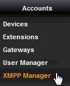
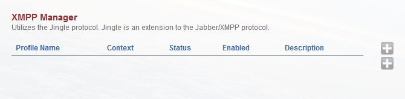
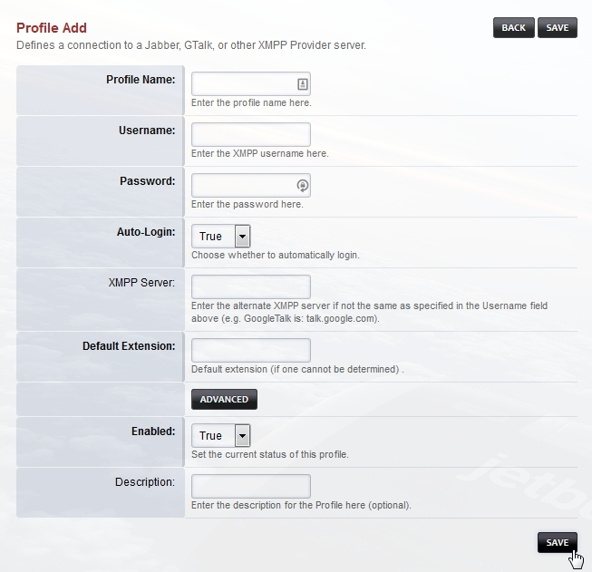
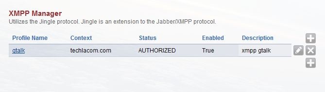

# XMPP Manager

| 

| 

| XMPP Manager is an optional menu item. In order to have the option for
  XMPP Manager, there are a few steps you need to take to enable it.

| 

| 

**XMPP Profile**

| FusionPBX menu.

| Accounts -\> XMPP manager.

| Click the

| on the right to create a profile.

| In this example we will setup Google Talk by creating a profile called
  gtalk.

    Profile Name: gtalk
    Username: your_user_account@gmail.com (use your account)
    Password: use the correct password
    Auto-Login: yes
    XMPP Server: talk.google.com

| 

| Two approaches can be used for the next part.

| **Option 1.**

| Lets say my gmail number was 13051231234. This approach will send the
  inbound calls to the inbound routes with a destination number that is
  the default extension number that is set.

    Default extension: 13051231234
    Advanced -> Context: public

| **Option 2.**

| On a single tenant system. This will send the call to extension 1001
  in the default context.

    Default extension: 1001
    Advanced -> Context: default

| **Option 3.**

| On a single tenant system. This will send the call to extension 1001
  in the multi-tenant domain name.

    Default extension: 1001
    Advanced -> Context: your.domain.com

| Save the settings and restart the module from Advanced -\> Modules
  page.
| Go back to Accounts -\> XMPP if the status says **\'AUTHORIZED\'**
  then you are ready to go!

| **Note** If you are not getting AUTHORIZED you might need to go to the
  google account settings and choose \"Allow less secure apps: ON\"
  under the Sign-in & security section.
  (<https://support.google.com/accounts/answer/6010255?hl=en>)

| 

| 

| **Outbound Routes**

| For this example we will use 11 digit dialing.

    Gateway: XMPP
    Dialplan Expression: 11 digits
    Description: Google Talk
    Press Save

| If your XMPP profile is named something other than gtalk edit the
  outbound route you just created.
| Bridge statement should look like:
  <dingaling/gtalk/+$1@voice.google.com> replace gtalk with the profile
  name you chose and then save it.

| 

## Enable XMPP

| 

| XMPP manager is used to configure client side XMPP profiles. It can be
  used as a client to register to make and receive call with Google Talk
  or other XMPP servers.

| 

| **GIT Manually add XMPP**
| 
| After version 3.8 XMPP is optional. To add XMPP do the following

| Go to command line

    cd /tmp
    git clone https://github.com/fusionpbx/fusionpbx-apps.git 
    cd fusionpbx-apps/
    mv xmpp/ /var/www/fusionpbx/app/
    cd /var/www/fusionpbx/app
    chown www-data:www-data -R xmpp/

Login to FusionPBX

| Go to the GUI and click Advanced \> Menu Manager \> edit icon \> click
  \"Restore Defaults\" at top right
| 

| Then go to Advanced \> Upgrade click Schema, Data Types, and
  Permission Defaults then click execute

| 
| Click Status \> SIP Status \> Flush Memcache

| 
| Log out then log back in

| 
| You should now have XMPP Manager under Accounts

| 
