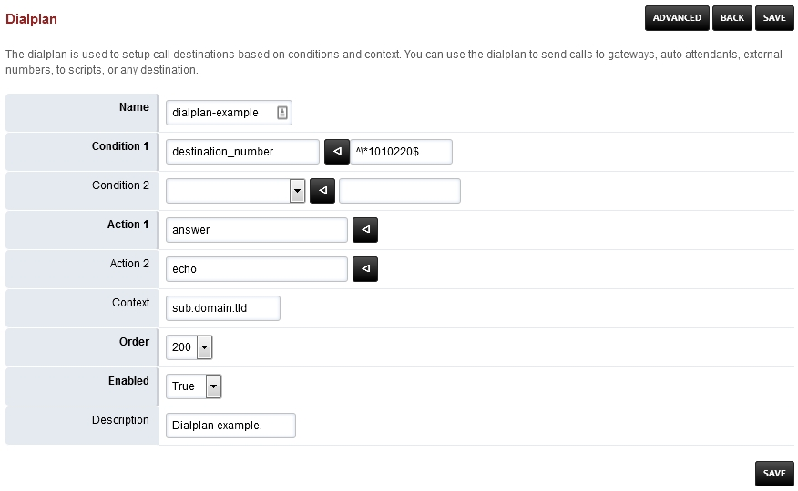

####################
Advanced Dialplans
####################

FusionPBX installs several default dialplans. FusionPBX also gives the option to make new dialplans. This gives you the power for more advanced functions, and produce the desired result.    

Adding a Dialplan
~~~~~~~~~~~~~~~~~~~

You can create a new dialplan or copy and modify an existing dialplan.

* Go to Dialplan > Dialplan Manager

* Click the **Plus** icon at the top right.

* Complete required fields and click save.

* Find the newly created dialplan and edit it if needed.

* Once you enter data into the empty fields at the bottom and click save, more blank fileds will populate if needed.

.. image:: ../_static/images/dialplan/fusionpbx_dialplan_advanced2.jpg
        :scale: 85%

Dialplan examples
~~~~~~~~~~~~~~~~~~~

This example will be for calling an extension on another tenant.  This can be done several ways.

* We can use the adding a dialplan example and modify it for this example.

.. image:: ../_static/images/dialplan/fusionpbx_dialplan_advanced2.jpg
        :scale: 85%

+--------+----------+------------------------------------------+-------+--------+-------+-------+
| Tag    | Type     | Data                                     | Break | Inline | Group | Order |
+========+==========+==========================================+=======+========+=======+=======+
|        |          |                                          |       |        |       |       |
+--------+----------+------------------------------------------+-------+--------+-------+-------+
| action | set      | domain_name=customer.domain.tld          |       | True   |       | 20    |
+--------+----------+------------------------------------------+-------+--------+-------+-------+
| action | set      | domain_uuid=correct-uuid-for-the-domain  |       | True   |       | 25    |
+--------+----------+------------------------------------------+-------+--------+-------+-------+
| action | transfer | extension XML ${domain_name}             |       |        |       | 30    |
+--------+----------+------------------------------------------+-------+--------+-------+-------+

