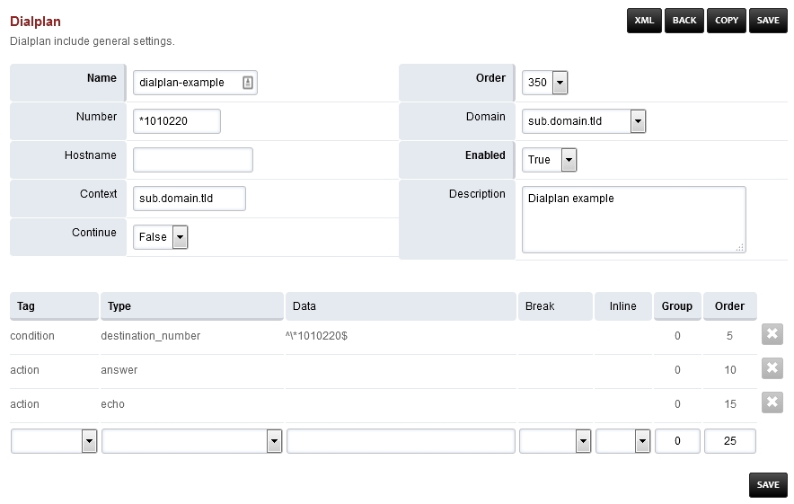
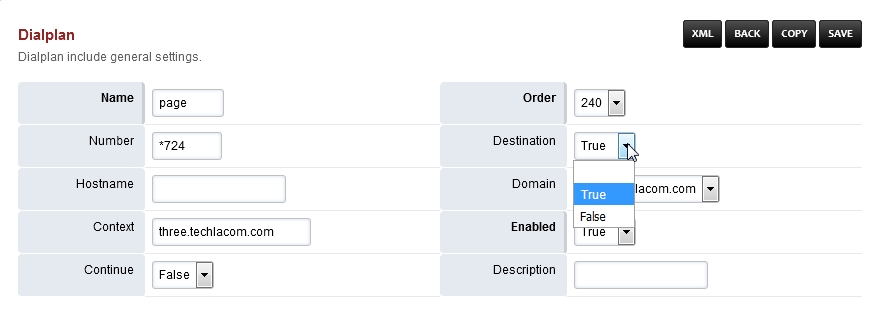

####################
Advanced Dialplans
####################

FusionPBX installs several default dialplans. FusionPBX also gives the option to make new dialplans. This gives you the power for more advanced functions, and produce the desired result.    

Adding a Dialplan
^^^^^^^^^^^^^^^^^^^

You can create a new dialplan or copy and modify an existing dialplan.

* Go to Dialplan > Dialplan Manager

* Click the **Plus** icon at the top right.

* Complete required fields and click save.

.. image:: ../_static/images/dialplan/fusionpbx_dialplan_advanced.jpg
        :scale: 85%

Edit a Dialplan
^^^^^^^^^^^^^^^^^

Find the dialplan you want to edit and click the edit icon.

.. image:: ../_static/images/dialplan/fusionpbx_dialplan_advanced1.jpg
        :scale: 85%

Once you enter data into the empty fields at the bottom and click save, more blank fileds will populate if needed.

Enable a Dialplan Destination
^^^^^^^^^^^^^^^^^^^^^^^^^^^^^^^

Dialplans that have a value in the **Number** filed can be enabled and used in `Dialplan > Destinations <../dialplan/destinations.html>`_. Setting the **destination** field to **True** will enable the dialplan to be visable and used as an action in `Dialplan > Destinations <../dialplan/destinations.html>`_.

Dialplan example
^^^^^^^^^^^^^^^^^^

This example will be for calling an extension on another tenant.  This can be done several ways.

* We can use the adding a dialplan example and modify it for this example.

Cross Tenant Calling
~~~~~~~~~~~~~~~~~~~~~~

This would require a prefix of 5 followed by 4 digit extensions. The prefix can be any number that you choose to use and the 4 digit extension must match the destination tenant. So if the destination extensions are 3 digit then you would use 3 instead of 4.

+-----------+---------------------------+------------------------------------------+-------+--------+-------+-------+
| Tag       | Type                      | Data                                     | Break | Inline | Group | Order |
+===========+===========================+==========================================+=======+========+=======+=======+
| condition | ${destination_number}     | ^5(\d{4})$                               |       |        |       | 5     |
+-----------+---------------------------+------------------------------------------+-------+--------+-------+-------+
| action    | set                       | domain_name=customer.domain.tld          |       | True   |       | 10    |
+-----------+---------------------------+------------------------------------------+-------+--------+-------+-------+
| action    | set                       | domain_uuid=correct-uuid-for-the-domain  |       | True   |       | 15    |
+-----------+---------------------------+------------------------------------------+-------+--------+-------+-------+
| action    | transfer                  | $1 XML ${domain_name}                    |       |        |       | 20    |
+-----------+---------------------------+------------------------------------------+-------+--------+-------+-------+

* Be sure to set the **Continue dropdown box True**

* Finally we have the desired dialplan to call from tenant A to tenant B.

.. note::
      A quick way to find a domains uuid is by going to Advanced > Domains.  Then click the edit icon on the domain you want to know the uuid of.  The uuid will be at the end of the url.

