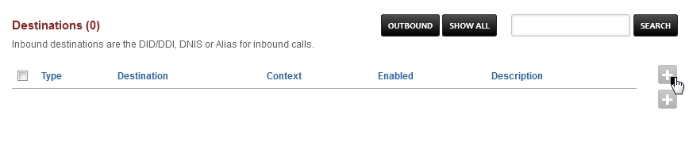

#############
Destinations
#############

Inbound destinations are the DID/DDI, DNIS or Alias for inbound calls. `Click here for the youtube video`_

.. raw:: html

    

    <iframe width="100%" height="350" src="https://www.youtube.com/embed/8-EJM0hd-J8?rel=0" frameborder="0" ; encrypted-media" allowfullscreen></iframe>
    

Configure Inbound Destinations: (This will auto-configure an Inbound Route also)

.. Tip::

   Outbound destinations can be created also.

*Select* **Dialplan** from the drop-down list and then *click* **Destinations**. 

To add a destination **click** on the **plus** button on the right. 

*Enter* the route information below and *Click* **Save** once complete.

* **Type:** Inbound or Outbound.  Choose if this is an inbound destination or outbound destination.
* **Destination:** This is usually the DID a caller will call.
* **Context:**  This will usually be public.
* **Actions:** Choose where the call will go after it enters FusionPBX.
        * Dialplans can also be used as an action. To enable a dialplan to be visable go to `Dialplan > Dialplan Manager <../dialplan/advanced_dialplans.html#enable-a-dialplan-destination>`_ and edit a dialplan.  Select **True** from the **Destination** field and click save.  This applies to dialplans that have a value in the **Number** field.

* **Caller ID Name Prefix:** Adds a name to the Caller ID that will display to the endpoint and call detail records.
* **Record:** Record all calls made to the destination.
* **Account Code:** Used in some billing systems.
* **Domain:** The domain can be global to all domains or domain specific.
* **Enabled:** Enabled will enable the destination or Disabled to disable the destination.
* **Description:** A way to label and organize what the destination is for.

* **Inbound Routes**
        * Once a Destination is created an inbound route is also created.  `Click here to view more about Inbound routes <http://docs.fusionpbx.com/en/latest/dialplan/inbound_routes.html>`_.

.. Note::
       Optional: Replace ^(?:\+?1)?(\d{10})$ in Inbound Routes with either 0123456789 or a DID Number depending on the Route Destination setting.
 
 
`Destinations Default Settings`_
---------------------------------------

.. _Destinations Default Settings: /en/latest/advanced/default_settings.html#id6
.. _Click here for the youtube video: https://youtu.be/8-EJM0hd-J8
