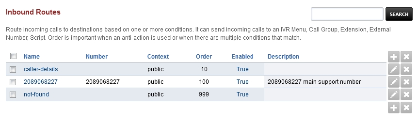
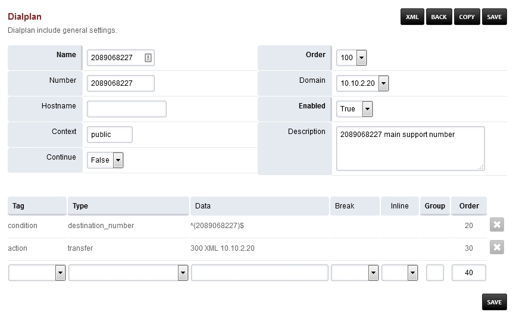

################
Inbound Routes
################

Route incoming calls to destinations based on one or more conditions. It can send incoming calls to:

* IVR Menu
* Call Group
* Extension
* External Number
* Script

Order is important when an anti-action is used or when there are multiple conditions that match. 

**Inbound routes can be used for advanced reasons**.  `Dialplan > Destinations <http://docs.fusionpbx.com/en/latest/dialplan/destinations.html>`_ **will create and configure the Inbound Route for you.**

* **Name:** The name of the Inbound Route.
* **Number:** The Number (DID) an outside caller will call.
* **Context:** Context of the Inbound Route. Usually will be public.
* **Hostname:** Usually blank, otherwise for advanced use.
* **Order:** Order where the inbound route will be used in the dialplan.
* **Enabled:** If the Inbound Route is enabled or disabled.
* **Description:** A way to organize what the inbound route is used for.

Edit/Add Inbound Routes
^^^^^^^^^^^^^^^^^^^^^^^^^

* **Name:** The name of the Inbound Route.
* **Number:** The Number (DID) an outside caller will call.
* **Context:** Context of the Inbound Route. Usually will be public.
* **Order:** Order where the inbound route will be used in the dialplan.
* **Domain:** Can be global to all domains or specific to one domain.
* **Continue:** If you want the call to continue through the order of the remaining dialplans. This is usually set as false.
* **Enabled:** If the Inbound Route is enabled or disabled.
* **Description:** A way to organize what the inbound route is used for.
