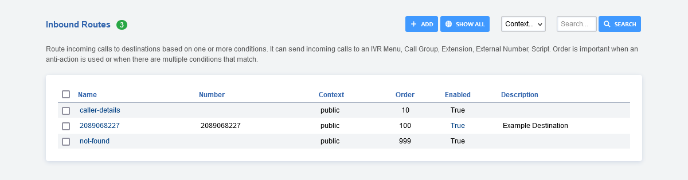
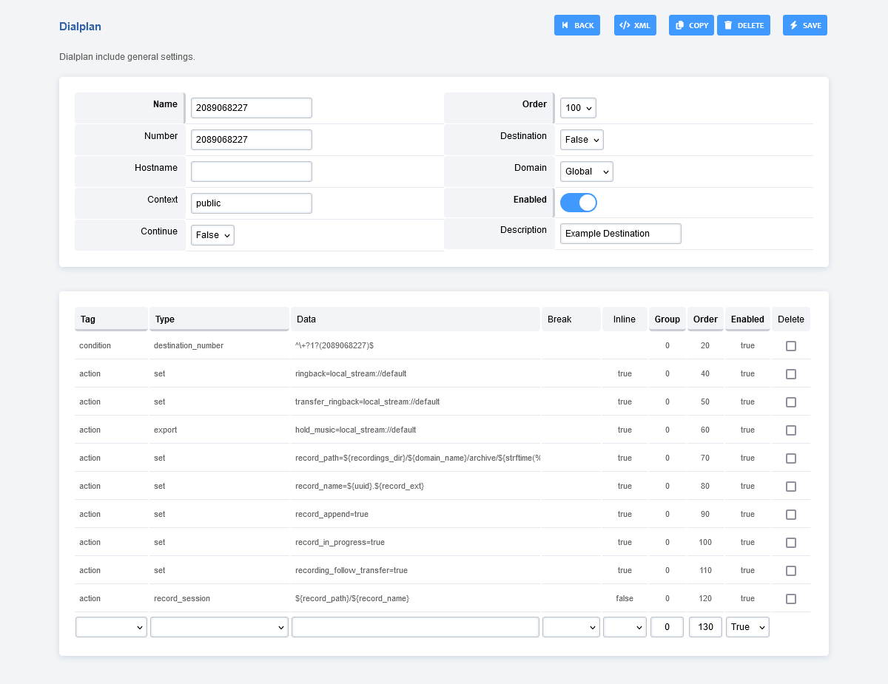

################
Inbound Routes
################

Route incoming calls to destinations based on one or more conditions. It can send incoming calls to:

* IVR Menu
* Call Group
* Extension
* External Number
* Script

Directs public inbound calls to an internal destination on the system.
Note that the only difference between the inbound route dial plan and the normal dial plan is that the inbound route dial plan works on all calls that are in the public context whereas the normal dial plan works on the domain context.

Inbound Call Routing is used to route incoming calls to destinations based on one or more conditions and context. It can send incoming calls to an auto attendant, huntgroup, extension, external number, or a script. Order is important when an anti-action is used or when there are multiple conditions that match.

**Inbound routes can be used for advanced reasons**.  `Dialplan > Destinations <http://docs.fusionpbx.com/en/latest/dialplan/destinations.html>`_ **will create and configure the Inbound Route for you.**

* **Name:** The name of the Inbound Route.
* **Number:** The Number (DID) an outside caller will call.
* **Context:** Context of the Inbound Route. Usually will be public.
* **Hostname:** Usually blank, otherwise for advanced use.
* **Order:** Order where the inbound route will be used in the dialplan.
* **Enabled:** If the Inbound Route is enabled or disabled.
* **Description:** A way to organize what the inbound route is used for.

Edit/Add Inbound Routes
^^^^^^^^^^^^^^^^^^^^^^^^^

* **Name:** The name of the Inbound Route.
* **Number:** The Destination Number (DID) an outside caller will call.
* **Context:** Context of the Inbound Route. Usually will be public.
* **Order:** Order where the inbound route will be used in the dialplan.
* **Domain:** Can be global to all domains or specific to one domain.
* **Continue:** If you want the call to continue through the order of the remaining dialplans. This is usually set as false.
* **Enabled:** If the Inbound Route is enabled or disabled.
* **Description:** A way to organize what the inbound route is used for.

Destination Number
^^^^^^^^^^^^^^^^^^^^^^^^^
Add button allows creating an inbound route. The list of destinations for the Destination Number select list is populated by the list from the Destinations tool. This list can be found by navigating to Menu -> Dialplan -> Destinations. Note: It is recommended to use Destinations tool and select where to route the call and have it build the inbound routes. There are many benefits to the destination select tool. Manually creating an inbound route is not recommended unless you need an advanced inbound route.

XML example
^^^^^^^^^^^^^

Route based on CallerID Name or Number.

Example used to send unwanted callers. (telemarketers that won't stop)

::

 <extension name="gotolennyCIDnumber" >
  <condition field="context" expression="public"/>
  <condition field="caller_id_number" expression="^1235554321$|^1235551234$">
     <action application="answer"/>
     <action application="bridge" data="sofia/${use_profile}/lenny@sip.itslenny.com:5060"/>
  </condition>
 </extension>

 <extension name="gotolennyCIDname" >
  <condition field="context" expression="public"/>
   <condition field="caller_id_name" expression="^.*THE.*ANNOYING.*COMPANY.*$|^.*OTHER.*ANNOYING.*CALLER.*$">
       <action application="answer"/>
       <action application="bridge" data="sofia/${use_profile}/lenny@sip.itslenny.com:5060"/>
   </condition>
 </extension>

