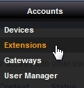
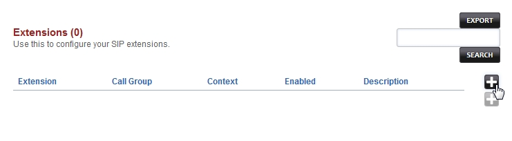
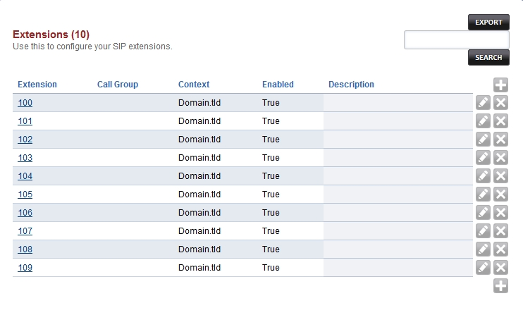
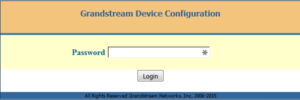
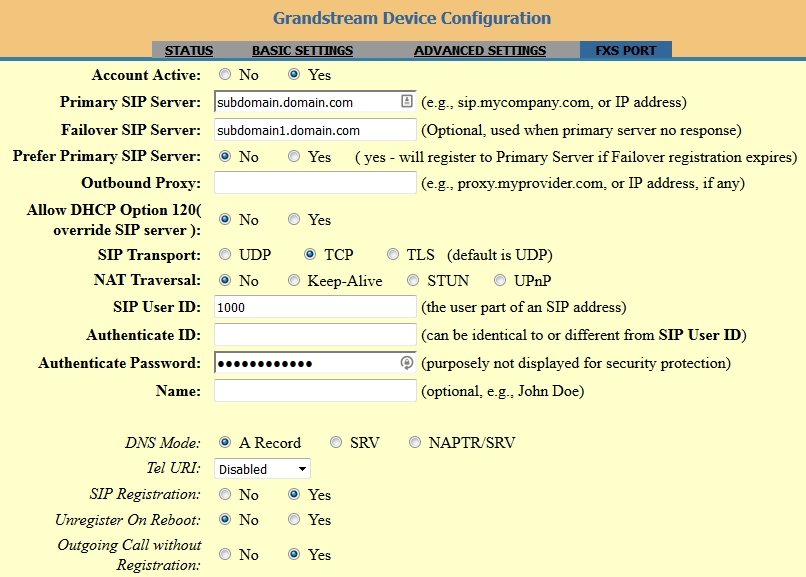

************
Extensions
************

|
|

Welcome to the adding Extensions section.  Here you will find how to add Extensions. 

|
|

Goto **Accounts** then click **Extensions**

|
|

Then click the

 .. image:: ../_static/images/plus.png
        :scale: 85%

on the right.

|

|
|

Enter the desired *extension* starting number.  From the dropdown *Range* box you can choose the desired block of extensions to start with. This can be done again later if needing more extensions.  Click **save** once entry is completed.  Entry can be customized for each idividual extension after this point.

|
|

|
|

We now have extensions. Each extension has and edit icon beside it.  Click the edit icon

|
|

 .. image:: ../_static/images/fusionpbx_ext2.jpg
        :scale: 85%

to customize internal, external, emergency caller id and other fine tuned options.  You can also access **Call Control** from here. 

|
|

|
|

Enter information as needed.

|

- **Extenson:** This is the extension number or name if used with Number Alias
- **Number Alias:** Number extension if extension is a name
- **Password:** mouse over to see the password
- **User List:** Add a user for this extesnion to login to the FusionPBX GUI interface
- **Voicemail Password:** Password for this extensions voicemail
- **Device Provisioning:** Used for hardware devices like voip phones and ata's
- **Account Code:** Can be used for billing
- **Effective Caller ID Name:** Used for internal caller id
- **Effective Caller ID Number:** Used for internal caller id
- **Outbound Caller ID Name:** Used for external (public) caller id
- **Outbound Caller ID Number:** Used for external (public) caller id
- **Emergency Caller ID Name:** Can be set to a national standard or local emergency entity
- **Emergency Caller ID Number:** Can be set to a national standard or local emergency entity

.. image:: ../_static/images/fusionpbx_ext4.jpg
        :scale: 85%

|
|

************
Registering Phones
************

|
|

Welcome to the Registering Phones section.  Here you will find how to configure some of the most popular phones to use with FusionPBX. 

|

Use this to configure your SIP extensions.

|

Grandstream
============

|

Registering an **Extension** using a hardware phone or adapter (ata) using Grandstream. 

|

Granstream is one of the common brand of phone and adapters for voip.  From call centers to offices and home offices Grandstream products can be found.  Grandstream has a large selection of hardware from phones, video phones to analog telephone adapters.

|

In our example we will register an analog telephone adapter (ata) model HT701.

|

1. Goto the device ip address. The default password should be admin. Enter admin and click login

|

2. Click on the **FXS PORT** tab on the top right.

| ``Primary Sip Server: subdomain.domain.com``
| ``Failover SIP Server: subdomain1.domain.com (this can be left blank or can use Primary if only 1 sip server)``
| ``SIP User ID: 1000``
| ``Authenticated Password: thepassword``

|

Click **Update** then click **Apply** at the bottom

|

|

3. Click the **Status** tab on the top left.  You should see the *Registration* as **Registered** and the *User ID* **1000**

.. image:: ../_static/images/fusionpbx_grandstream1.jpg
        :scale: 85%

|

- Troubleshooting tips

|

* Check, double check that the correct extension number and password is being used.
* Reboot the device.
* Check Fail2ban and see if the ip got blocked.
* Make sure you have created an DNS A record for the domain being used and there are no typos
* Nat, firewalls and router settings.  Some brands of routers can cause issues.  Google the make and model of router or firewall appliance for common settings or remedies.
* Visit Grandstream Supoprt http://www.grandstream.com/support
|
|

Zoiper
=======

|
|

Registering an **Extension** using the softphone Zoiper.

|

In the ever changing world of voip businesses are moving away from hardware phones.  From call centers to home offices Zoiper and many other softphones make use of software for communication needs for not only voice but video and faxing. This example will show how to register an extension using Zoiper for Windows. *Note* Zoiper can be used on several operating systems and mobile devices.

|
1. Download the software. .. Zoiper: http://www.zoiper.com/
2. Install the software.
3. If the software isn't open click the Zoiper icon to open from the desktop or start menu.

.. image:: ../_static/images/fusionpbx_zoiper.jpg
        :scale: 85%

|

4. Click on **Settings**

.. image:: ../_static/images/fusionpbx_zoiper1.jpg
        :scale: 85%

|

5. Click on **Preferences**

.. image:: ../_static/images/fusionpbx_zoiper2.jpg
        :scale: 85%

|

6. Click on **Create account**

.. image:: ../_static/images/fusionpbx_zoiper3.jpg
        :scale: 85%

|

7. Enter the user, password and domain name.

| ``user: 1000``
| ``password: thepassword``
| ``domain: sub.domain.com``

|

.. image:: ../_static/images/fusionpbx_zoiper4.jpg
        :scale: 85%

|

8. Click ok.  You should have **Registered** at the top right

.. image:: ../_static/images/fusionpbx_zoiper5.jpg
        :scale: 85%

|

- Troubleshooting tips

|

* Check, double check that the correct extension number and password is being used.
* Check Fail2ban and see if the ip got blocked.
* Make sure you have created an DNS A record for the domain being used and there are no typos
* Nat, firewalls and router settings.  Some brands of routers can cause issues.  Google the make and model of router or firewall appliance for common settings or remedies.
* Visit Zoiper Community Supoprt http://community.zoiper.com/
|
|

.. toctree::
  :maxdepth: 3
  :glob:

  extensions_ivr/extensions.rst
