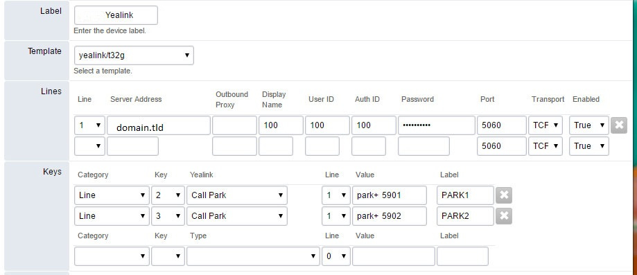

################
Parking
################

Call "parking" transfers a current call to an available park extension, where the caller will listen to Music on Hold.  The extension that originally received the call is now free to accept other calls or direct another extension to join the call that was parked.

For example:
  The receptionist receives a call, and the caller would like to speak to the engineering department.  The receptionist says "please hold while I transfer you," and presses the PARK1 button.  The call is sent to extension 5901 and the caller listens to music on hold.  The receptionist is now free to make a call to her engineering staff, or pages the engineering page group and says "Engineering you have a call on PARK1."
  
  The Engineer can press the flashing park button on his phone, and he will be connected to the caller, and the park extension will be freed for another call.
  
  Multiple park extensions can be created.  Phones can be programmed with BLF functionality for parked extensions, so the users can see if there is a call in that extension.
  

Below is an example of how to provision a Yealink SIP-T32G, which has 3 Line buttons.

