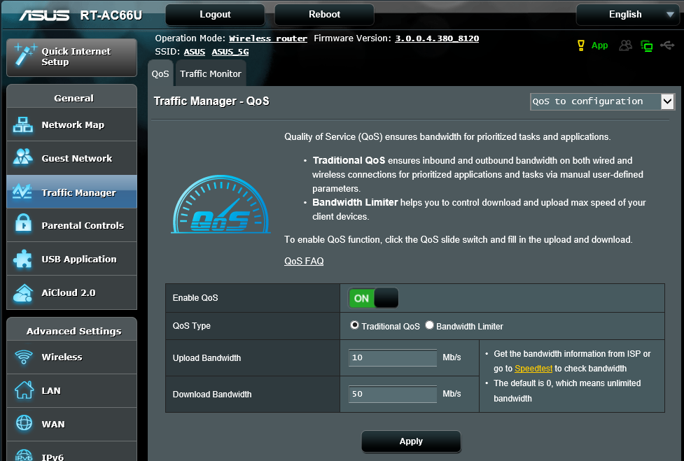
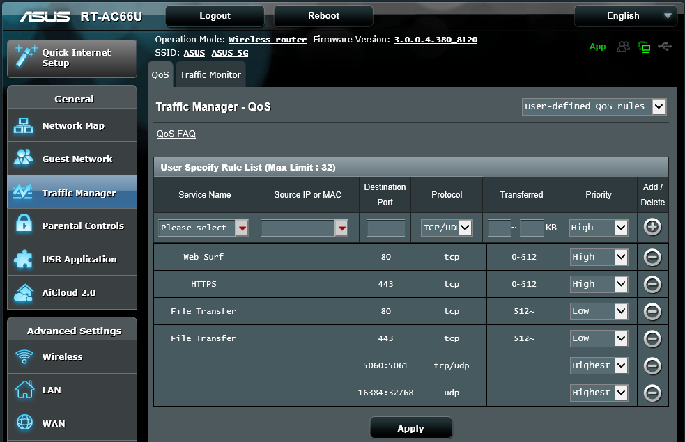

##############
ASUS RT-AC66U
##############

This guide was created for the ASUS RT-AC66U router with Firmware Version 3.0.0.4.380_8120.  FusionPBX is in the cloud with a public IP, and the ASUS RT-AC66U router is at the customer’s location with the extensions behind it.  The RT-AC66U is a “prosumer” grade router.  It has good performance for the dollar and is a good choice for home offices.

 

How to setup QoS

 

First, enable the QoS feature:

* Log into the router
* Click “Traffic Manager” on the left menu
* Click the “Enable QoS” button to turn it on.  Once you do this, the Upload and Download Bandwidth boxes will appear.
* Enter in your Up/Down speeds.  You can use http://beta.speedtest.net/ as noted.
* Click the Apply button and wait for the router to reboot.

Next, assign the QoS rules.

* Log back into the router after rebooting, and go to Traffic Manager.
* On the top-right selection box, select “user-defined QoS rules” if it is not already selected
* Your settings may vary based on your environment, but you can use the image below as a good starting point.
* It is important to note that the default rules set “Web Surf” and “HTTPS” to highest priority.  We don’t want that to compete with VOIP traffic, so reduce those to “High.”
* Click Apply.

.. Note::

 An important note regarding Priorities

 

 Another important area is the “user-defined priorities” section of Traffic Manager – QoS.  As you can see, the default rules     give a very large amount of the bandwidth share to the highest priority.  This is very likely excessive for VOIP traffic.  We don’t need much bandwidth, we just need to make sure we get prioritized traffic.  You should adjust these to suit your environment.

.. image:: ../../_static/images/firewall/fusionpbx_asus_traffic_manager_qos_note.png
        :scale: 85%

