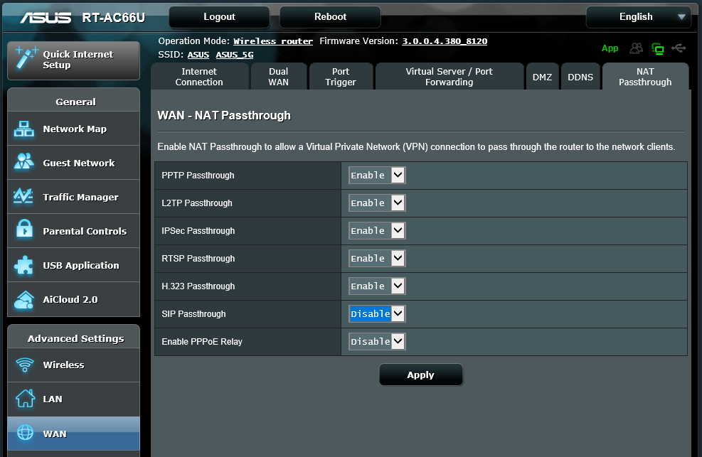

######################
ASUS RT-AC66U SIP ALG
######################

This guide was created for the ASUS RT-AC66U router with Firmware Version 3.0.0.4.380_8120.  FusionPBX is in the cloud with a public IP, and the ZyXEL USG60 router is at the customer’s location with the extensions behind it.  The RT-AC66U is a “prosumer” grade router.  It has good performance for the dollar and is a good choice for home offices.

 

How to Disable SIP ALG

* Log into the router
* On the left nav menu, click “WAN”
* Click the “NAT Passthrough” tab at the top-right
* Set “SIP Passthrough” to Disable
* Click Apply
* Reboot the router.

 

This part is a little confusing.  It seems that ASUS has either reversed the meaning of SIP Passthrough or changed how it works over a few firmware releases.  At any rate, if you have difficulties with Audio or Registrations, you can try toggling this setting.  With these home-grade routers you should perform a full reboot in order to clear the tables before testing the phones.

