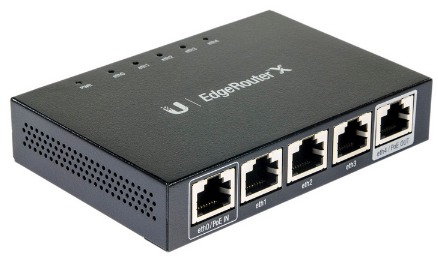
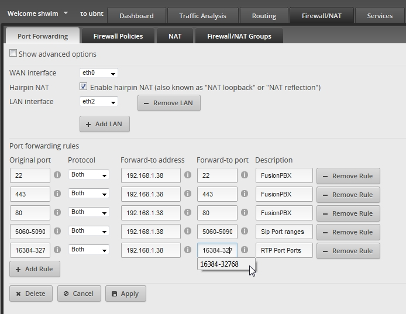
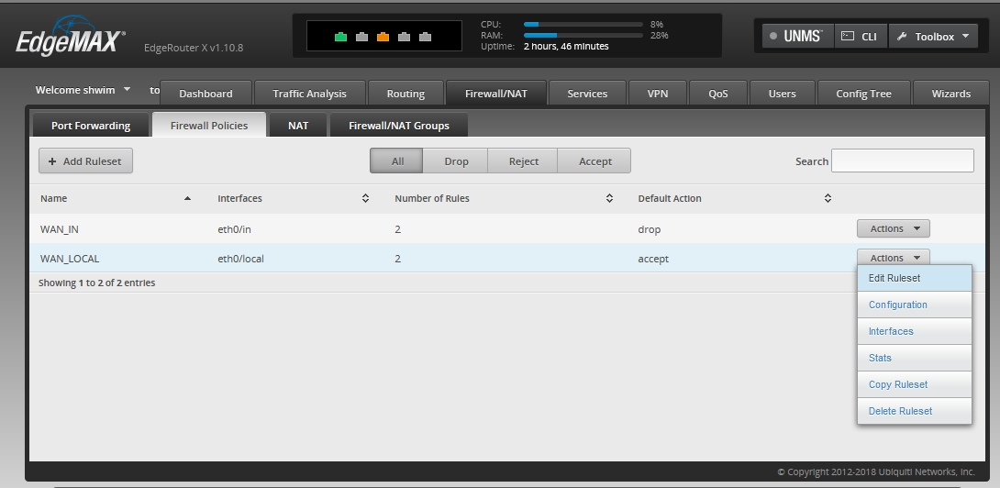
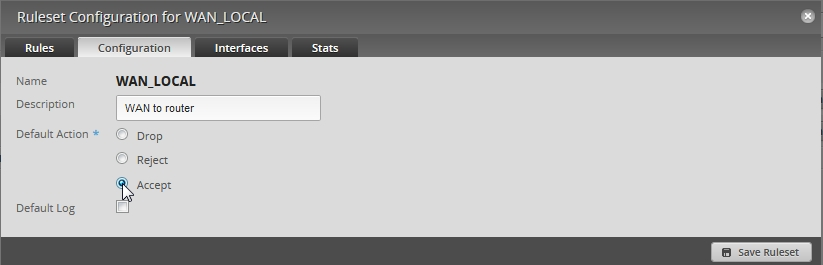
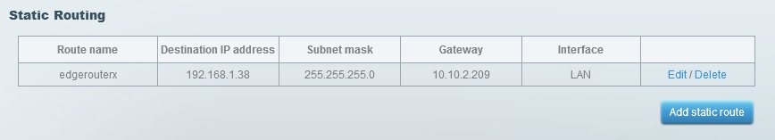

######################
Ubiquiti Edgerouter
######################

Ubiquiti Edgerouter Advanced Gigabit Ethernet Router.

Port Forwarding
^^^^^^^^^^^^^^^^^

Go to top first menu item Firewall/NAT then second top menu item Port Forwarding.

* Optional: SSH port 22 is optional.
* Required: Sip port range 5060-5090 is recomended.
* Required: HTTPS port 443 is required in order to access your FusionPBX installation and phone provisioning.
* Optional: HTTP port 80 is used by some phone manufactures for provisioning.
* Required: RTP port range 16384-32768.

.. note::
       In order to Port Forward and still have access to the Edgerouter GUI you must change the port number for the Edgerouter GUI.

Access from another LAN Subnet
^^^^^^^^^^^^^^^^^^^^^^^^^^^^^^^^^

If you are behind NAT and are going to use the Edgerouter subnet in addition to an existing subnet (behind another router) also some setting changes are required. These settings are only recommended in this scenerio.

* Go to First top menu Firewall/NAT tab.
* Go to Second top menu Firewall Policies.
* Edit WAN_LOCAL at the right menu item Actions > Edit RuleSet 

* From the Configuration tab, Change the radio button to "Accept" and click "Save Ruleset".

.. warning::
         Be sure you want to do this and that you are behind either a firewall appliance or another router.

Add Static Route (Double NAT)
^^^^^^^^^^^^^^^^^^^^^^^^^^^^^^^^

This will look different depending on the other router that you might have and what IP range you use.

* A static route is needed on the other router in order for traffic to reach your FusionPBX installation and is only needed if the Edgerouter is the double NAT.

Scenerio: Router A is the primary router that has a public IP address and a LAN subnet of 10.10.2.1. From this pool of IP addresses, the Edgerouter gets IP 10.10.2.209. *Be sure that router A has DHCP reservation or the ability to make 10.10.2.209 a static IP*. 

* **Router A Router name:** This is a label for organizing.
* **Router A Destination IP address:** 192.168.1.38 This is the IP that the Edgerouter gave to your FusionPBX install.
* **Router A Subnet mask:** 255.255.255.0 is the subnet mask used in this example.
* **Gateway:** 10.10.2.209 is the IP Router A gave to the Edgerouter WAN eth0.
* **Interface:** LAN is a label on Router A to show it's a local area network address.

Ubiquiti Edgerouter SIP ALG
^^^^^^^^^^^^^^^^^^^^^^^^^^^^^^^^

In some scenerios you may have to turn off SIP ALG.  

Check if SIP ALG is running
^^^^^^^^^^^^^^^^^^^^^^^^^^^^^

* **Command:** lsmod | grep sip

 
::
 
  shwim@ubnt:~$ lsmod | grep sip
  nf_nat_sip              8853  0
  nf_conntrack_sip       21773  1 nf_nat_sip
  nf_nat                 13284  10 nf_nat_ftp,nf_nat_sip,ipt_MASQUERADE,nf_nat_proto_gre,nf_nat_h323,nf_nat_ipv4,nf_nat_pptp,nf_nat_tftp,xt_nat,iptable_nat
  nf_conntrack           62604  18 nf_nat_ftp,nf_nat_sip,xt_CT,nf_conntrack_proto_gre,ipt_MASQUERADE,nf_nat,nf_nat_h323,nf_nat_ipv4,nf_nat_pptp,nf_nat_tftp,xt_conntrack,nf_conntrack_ftp,nf_conntrack_sip,iptable_nat,nf_conntrack_h323,nf_conntrack_ipv4,nf_conntrack_pptp,nf_conntrack_tftp
  shwim@ubnt:~$

 
This shows that SIP ALG is running in the example above.

Disable SIP ALG
^^^^^^^^^^^^^^^^^

To disable SIP ALG:

* Either click on the CLI button from the Ubiquiti Edgerouter GUI or via you favorite SSH client to the Edgerouter.
* **Then type:** configure
* **Then type:** set system conntrack modules sip disable
* **Then type:** commit
* **Then type:** save
* **Then type:** exit

::

 root@ubnt:/home/shwim# configure
 [edit]
 root@ubnt# set system conntrack modules sip disable
 [edit]
 root@ubnt# commit
 [edit]
 root@ubnt# save
 Saving configuration to '/config/config.boot'...
 Done
 [edit]
 root@ubnt# exit

Enable SIP ALG
^^^^^^^^^^^^^^^^^

To enable SIP ALG:

* Either click on the CLI button from the Ubiquiti Edgerouter GUI or via you favorite SSH client to the Edgerouter.
* **Then type:** configure
* **Then type:** set system conntrack modules sip enable-indirect-media
* **Then type:** set system conntrack modules sip enable-indirect-signalling
* **Then type:** commit
* **Then type:** save
* **Then type:** exit

::

 root@ubnt:/home/shwim# configure
 [edit]
 root@ubnt# set system conntrack modules sip enable-indirect-media
 [edit]
 root@ubnt# set system conntrack modules sip enable-indirect-signalling
 [edit]
 root@ubnt# commit
 [edit]
 root@ubnt# save
 Saving configuration to '/config/config.boot'...
 Done
 [edit]
 root@ubnt# exit

.. note::

   set system conntrack modules sip port <1-65535> will change the sip port number  

