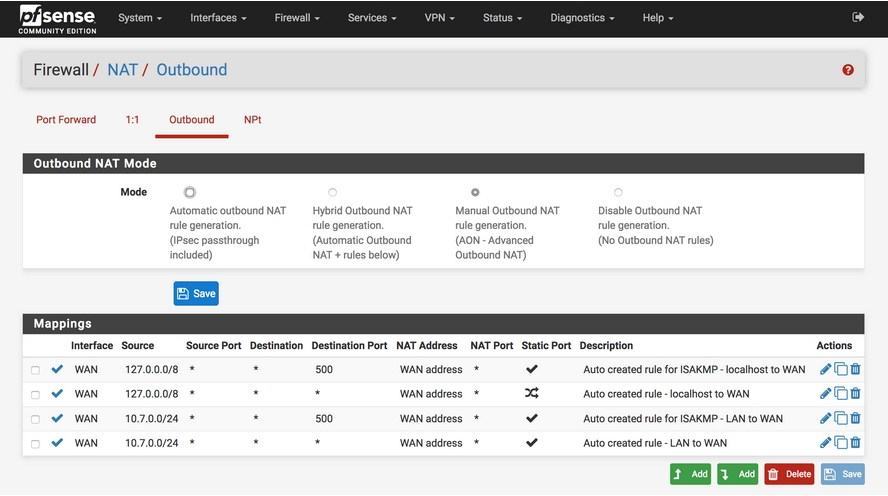
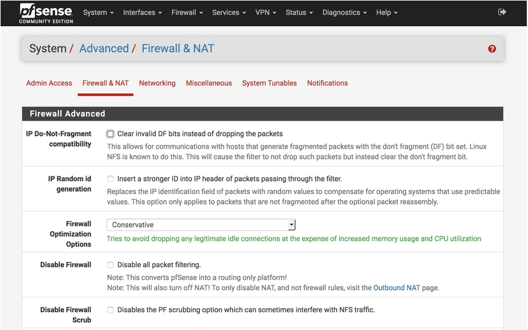
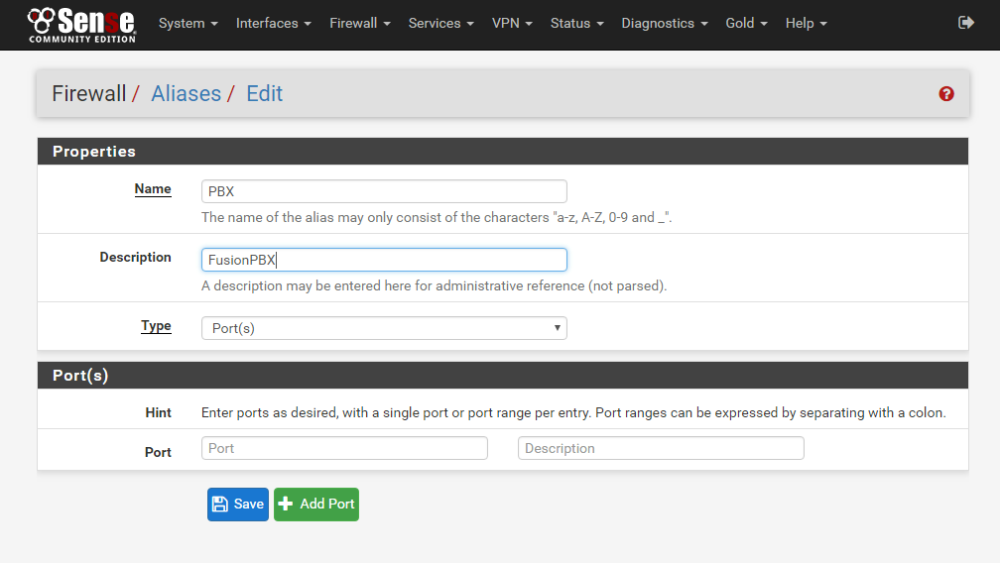
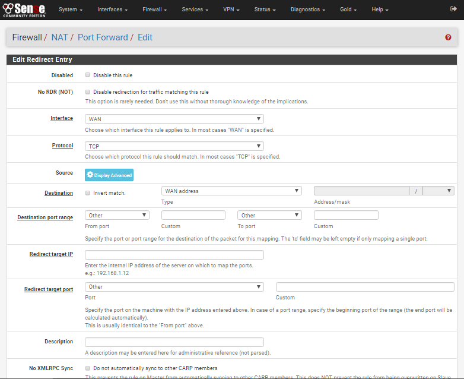

##########
pfSense
##########

**Static Port**
----------------------------------------

Menu -> NAT -> Advanced Outbound NAT (enabled)

set static port to yes

**Firewall Optimization - Conservative**
----------------------------------------

System -> Advanced -> Firewall NAT -> Firewall Optimization

select Conservative

**Create Alias Ports in pfSense**
----------------------------------------

* Configure pfSense to open the necessary ports for FusionPBX and Freeswitch.
* In pfSense navigate to Firewall >> Aliases and click on the Ports TAB.

::

 Name:          PBX
 Description:   FusionPBX
 Type:          Ports

* Then proceed to add the ports as follows.

::

 Port          Description
 80            HTTP
 443           HTTPS
 5060:5061     SIP Internal
 5080:5081     SIP External
 16384:32768   RTP
 

* After you are finished Click SAVE.

**Configure pfSense Port Forwarding**
-----------------------------------------

* Click on the '+' to ADD a new Entry.

* Firewall >> NAT >> Port Forward: Add

::
 
 Interface: WAN
 Protocol: TCP/UDP
 Destination: <<Select a Public IP from the List>>
 Destination Port Range:  
                      from: (Other) PBX
                      to:   (Other) PBX
 
::
 
 Redirect target IP:    10.10.0.10
 Redirect target port:  (Other) PBX

::

 Description: FusionPBX
 NAT reflection: Use system default

* Click SAVE when done.

**Configure FusionPBX**
-----------------------------

* In FusionPBX

* **System >> Variables > IP Address Section**
If you have a static public IP you can replace XX.XX.XX.XX with that IP. 

::

 external_rtp_ip   XX.XX.XX.XX
 external_sip_ip   XX.XX.XX.XX
 
If you have a dynamic IP address you can get a Dynamic DNS from a company such as dyndns.org.

::

 external_rtp_ip   myname.dyndns.org
 external_sip_ip   myname.dyndns.org
 
**Advanced >> SIP Profiles**

Edit the Internal Profile and add

::
 
 Name:    aggressive-nat-detection
 Value:   true
 Enabled: True

**Status >> SIP Status**
Stop and Start the internal profile for the changes to take effect.

.. note::

   More information can be found at https://www.netgate.com/docs/pfsense/nat/configuring-nat-for-voip-phones.html

