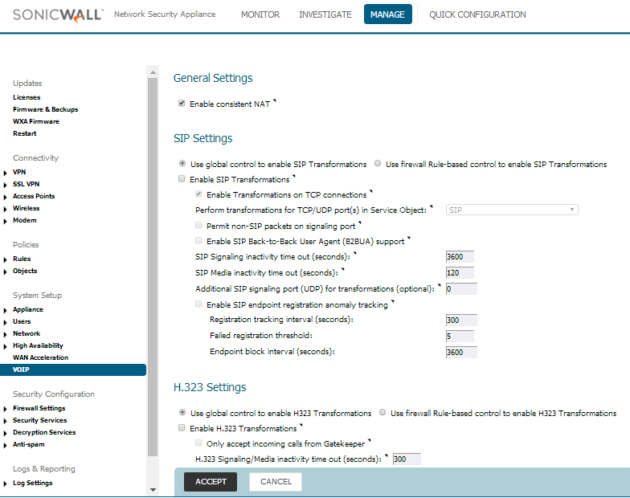

##################
SonicWall TZ-SOHO
##################

This guide was created using 6.5.0.1-14n firmware on a SonicWall TZ-SOHO series UTM router. FusionPBX is in the cloud with a public IP, and the SonicWall router is at the customer’s location with the extensions behind it.

How to setup Bandwidth Management
^^^^^^^^^^^^^^^^^^^^^^^^^^^^^^^^^^

**First, enable Global Bandwidth Management:**

* Log into the SonicWall and go to Security Configuration -> Firewall Settings -> Bandwidth Management
* For Bandwidth Management Type, click the Global radio button.
* This will enable BWM for all traffic.
Enable your required Priority levels.  For voice traffic, we’ll enable the “0 Realtime” priority level.

.. image:: ../../_static/images/firewall/fusionpbx_sonicwall_bwm1.png
        :scale: 85%

The SonicWALL needs to be programmed with your available WAN interface bandwidth.  You can go to beta.speedtest.net or similar to find your speed.

* Log into the SonicWall and go to Network -> Interfaces.  Edit your WAN Interface.
* Click the Advanced tab, check both the Egress and Ingress boxes under Bandwidth Management.
* Enter in your speed test values, and click OK

Now create your VOIP services.  In this example we’ll use 5060TCP, 5060UDP, and 16384-32768UDP for voice traffic.

* Go to Policies -> Objects -> Service Objects, and click Add.
* Add objects for your VOIP services.  On typical installs this would be 5060TCP/UPD and 16384-32768UDP.
* Click on the Service Groups tab and add all of the services you’ve created to a group.

Next, set up an Object for your Cloud PBX:

* Go to Policies -> Objects -> Address Objects, and click Add
* Add your PBX to the WAN Zone assignment with your IP as the Host, or use FQDN if you prefer.  If using multiple servers, add each one and create a group.

Now that we have our Service and Object, we can create a firewall rule and apply prioritization.

* Go to Policies -> Rules -> Access Rules, and click Add.
* Create a rule from the WAN to the LAN, using the VOIP services that you created, and your PBX as the source.  Make sure the Enable SIP Transformation box is unchecked.
* Click the BWM tab and check the Egress and Ingress boxes, with the desired priority level.

        

        
Save your settings and give it a try!       
        

SonicWall TZ-SOHO SIP ALG
^^^^^^^^^^^^^^^^^^^^^^^^^^^

This guide was created for the SonicWall TZ-SOHO router with Firmware Version 6.5.0.1-14n. This has the newer GUI version and looks quite a bit different than the GUI that had been used in previous years.  FusionPBX is in the cloud with a public IP, and the TZ-SOHO router is at the customer’s location with the extensions behind it.

 

How to Disable SIP ALG

* Log into the router
* Click the MANAGE tab at the top
* On the left menu, go to System Setup-> VOIP
* Check the “Enable consistent NAT” box
* Uncheck the “Enable SIP Transformations” box
* Click ACCEPT

