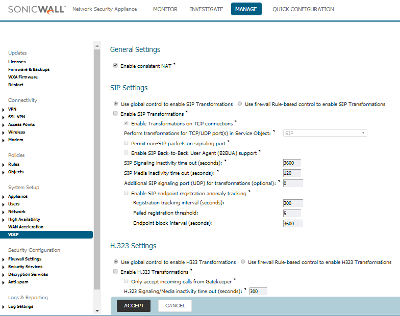

##########################
SonicWall TZ-SOHO SIP ALG
##########################

This guide was created for the SonicWall TZ-SOHO router with Firmware Version 6.5.0.1-14n. This has the newer GUI version and looks quite a bit different than the GUI that had been used in previous years.  FusionPBX is in the cloud with a public IP, and the TZ-SOHO router is at the customer’s location with the extensions behind it.

 

How to Disable SIP ALG

* Log into the router
* Click the MANAGE tab at the top
* On the left menu, go to System Setup-> VOIP
* Check the “Enable consistent NAT” box
* Uncheck the “Enable SIP Transformations” box
* Click ACCEPT

